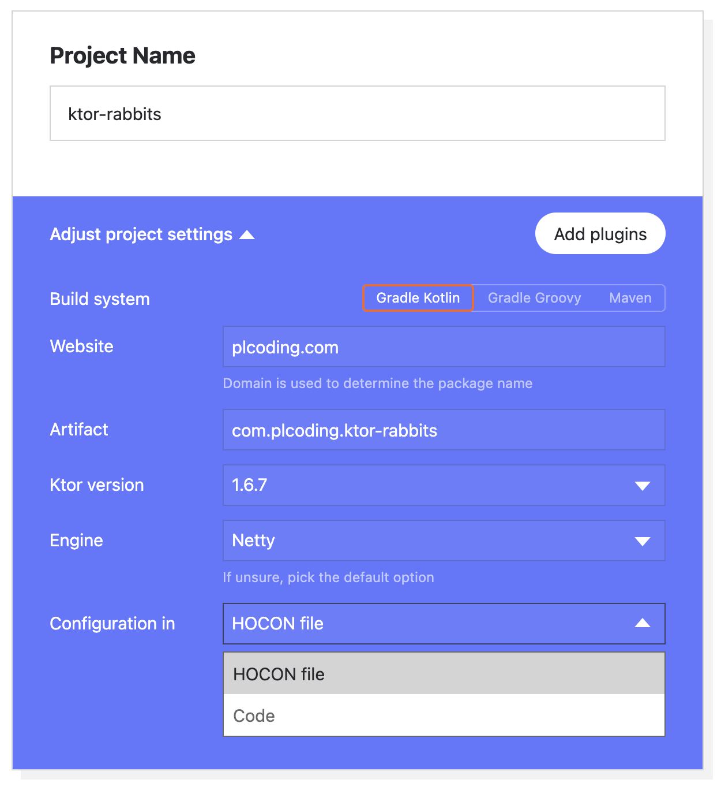
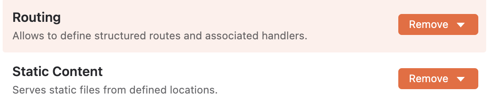
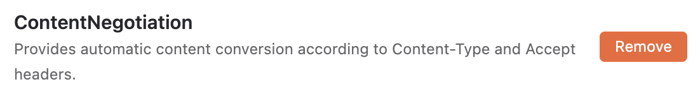
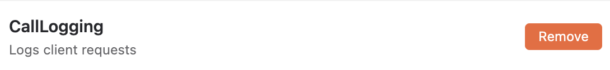
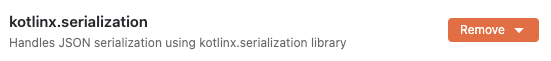
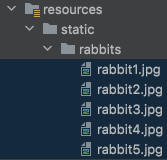
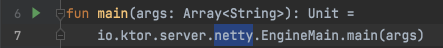
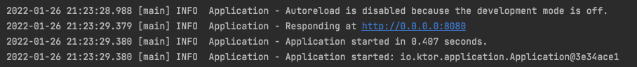
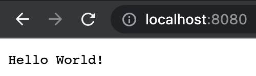
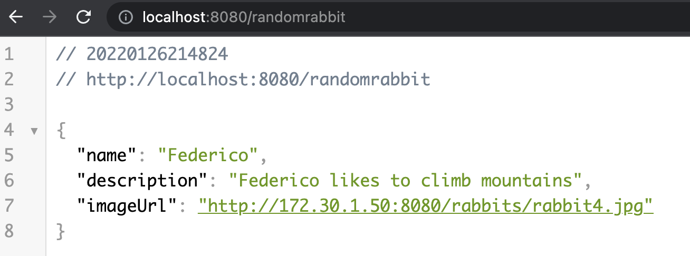

# How to Build a Simple REST API - Setup Ktor Server

토끼 사진을 제공해주는 API를 만들고, 안드로이드 앱에 출력해보자.

## Setup ktor server

[여기로](https://start.ktor.io/) 이동해 ktor 프로젝트를 생성한다.

<div align="center">

</div>

### Add plugins

- Static Content : 이미지, pdf와 같은 리소스 파일들 제공하기 위함
- ContentNegotiation : JSON 파싱하기 위함

<div align="center">




</div>

프로젝트 다운로드가 완료되면 IntelliJ로 열고, `resources/static/rabbits`에 5개의 토끼 이미지를 추가한다.

<div align="center">

</div>

ktor의 entry point는 Application.kt이다. `module`에 플러그인에 대한 정보가 위치한다.

```kotlin
fun main(args: Array<String>): Unit =
        io.ktor.server.netty.EngineMain.main(args)

@Suppress("unused") // application.conf references the main function. This annotation prevents the IDE from marking it as unused.
fun Application.module() {
    configureRouting()
    configureSerialization()
    configureMonitoring()
}
```

`plugins/Monitoring`을 확인하면 `install(CallLogging)` 블록에서 플러그인에 대한 설정을 수행한다.

```kotlin
fun Application.configureMonitoring() {
    install(CallLogging) {
        level = Level.INFO
        filter { call -> call.request.path().startsWith("/") }
    }

}
```

`resources`의 `application.conf` 파일에서 실행될 서버 포트 모듈 등을 설정할 수 있다.

```kotlin
ktor {
    deployment {
        port = 8080
        port = ${ ?PORT }
    }
    application {
        modules = [com.plcoding.ApplicationKt.module]
    }
}
```

`Application.kt` 파일에서 초록색 화살표를 눌러 서버를 실행할 수 있다.

<div align="center">


</div>

실행 후 `localhost:8080`으로 접속하면 다음과 같이 출력되는 것을 확인할 수 있다.

<div align="center">

</div>

`plugins`의 `Routing.kt` 파일에서 위 `Hello World!`를 출력해주는 root(/) routing을 제거한다.

```kotlin
routing {
    // Static plugin. Try to access `/static/index.html`
    static("/static") {
        resources("static")
    }
}
```

`plugins`의 `Serialization.kt` 파일에서도 기존에 있던 `routing` 블럭을 제거해준다.

```kotlin
fun Application.configureSerialization() {
    install(ContentNegotiation) {
        json()
    }
}
```

`routes` 패키지를 생성하고 `RabbitRoutes` 파일을 생성한다.

```kotlin
private const val BASE_URL = "http://localhost:8080"

fun Route.randomRabbit() {
    // client가 접근할 URI
    get("/randomrabbit") {

    }
}
```

`data.model`에 `Rabbit` 파일을 생성한다.

```kotlin
// 이 클래스를 직렬화
@Serializable
data class Rabbit(
        val name: String,
        val description: String,
        val imageUrl: String
)
```

`RabbitRoutes`에 랜덤한 토끼를 제공하는 `/randomrabbit` API를 생성한다.

```kotlin
private const val BASE_URL = "http://172.30.1.50:8080"

private val rabbits = listOf(
        Rabbit("Carl", "A cute brown rabbit", "${BASE_URL}/rabbits/rabbit1.jpg"),
        Rabbit("Emma", "Emma likes to eat apples", "${BASE_URL}/rabbits/rabbit2.jpg"),
        Rabbit("Florian", "Florian is always hungry", "${BASE_URL}/rabbits/rabbit3.jpg"),
        Rabbit("Federico", "Federico likes to climb mountains", "${BASE_URL}/rabbits/rabbit4.jpg"),
        Rabbit("Gina", "Gina is a true beauty", "${BASE_URL}/rabbits/rabbit5.jpg")
)

// 백엔드에 적용하기 위해 routing configuration에서 호출해야 함
fun Route.randomRabbit() {
    get("/randomrabbit") {
        call.respond(
                HttpStatusCode.OK,
                rabbits.random()
        )
    }
}
```

생성한 `randomRabbit()` route를 추가해준다.

```kotlin
fun Application.configureRouting() {

    routing {
        randomRabbit()
        // Static plugin. Try to access `/static/index.html`
        static("/static") {
            resources("static")
        }
    }
}
```

`randomrabbit`로 접근하면 다음과 같이 토끼의 정보를 얻을 수 있다. 하지만 지금 `imageUrl`로 접근하면 페이지를 찾을 수 없다.

<div align="center">

</div>

`Routing.kt`의 static 설정이 `/static`으로 되어있기 때문에 이를 제거해주면 된다.

```kotlin
static {
    resources("static")
}
```

이제 ktor 서버 구현은 완료되었다. 안드로이드 구현은 [How to Build a Simple REST API - Make an android app](https://github.com/beomsu317/study/blob/main/contents/android/example/how-to-build-a-simple-rest-api/how-to-build-a-simple-rest-api.md)를 확인하자.

## References

* [How to Build a Simple REST API With Ktor + Android App](https://www.youtube.com/watch?v=c6I3Dw0xDlQ&list=WL&index=2&t=11s)