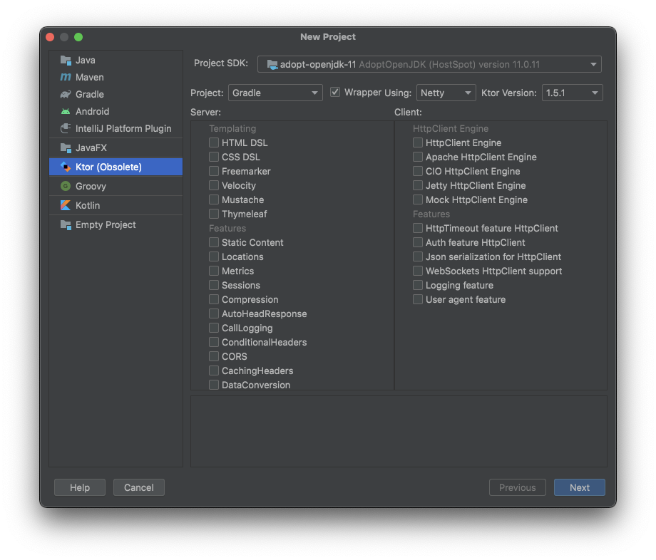
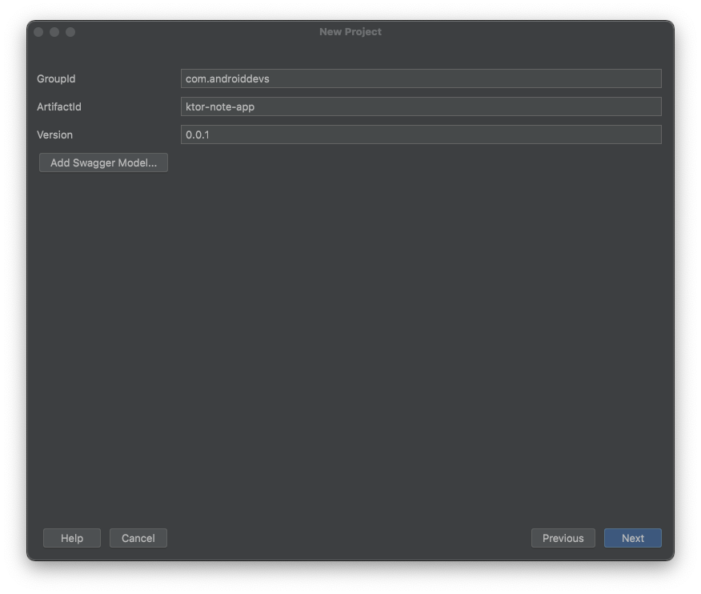
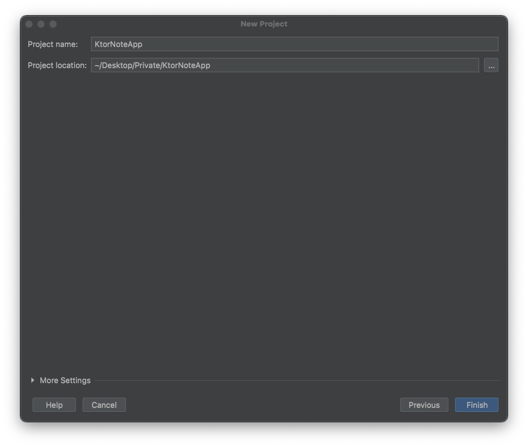
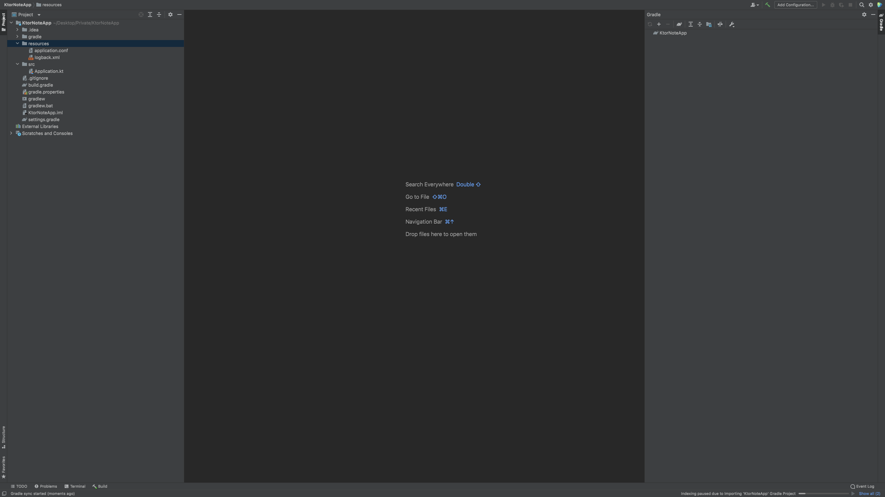
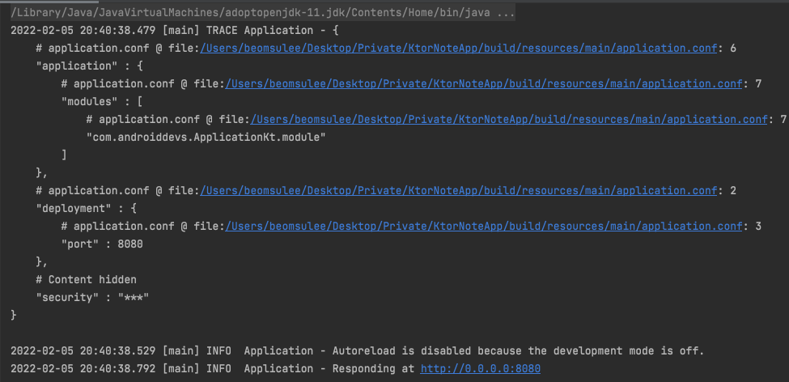

# Creating our Ktor project and settings

Ktor 개발에 필요한 플러그인(Ktor)을 IntelliJ에 추가한다.

Ktor 플러그인을 설치한 후 New Project를 통해 Ktor 프로젝트를 생성할 수 있다. 다음과 같이 프로젝트 설정을 해준다.

<div align="center" class="column">
<div></div>
<div></div>
<div></div>
</div>

다음은 프로젝트가 생성된 후 구조이다.

<div align="center">

</div>

그리고 다음과 같이 `build.gradle` 파일의 `repositories`에 2개의 maven 레포지토리와 `kotlinOptions`과 필요한 디펜던시들을 설정해준다.

```groovy
// ...
repositories {
    mavenLocal()
    jcenter()
    maven { url 'https://kotlin.bintray.com/ktor' }
    maven { url 'https://kotlin.bintray.com/kotlin-js-wrappers' }
}

tasks.withType(org.jetbrains.kotlin.gradle.tasks.KotlinCompile).all {
    kotlinOptions {
        jvmTarget = "1.8"
    }
}

dependencies {
    implementation "org.jetbrains.kotlin:kotlin-stdlib-jdk8:$kotlin_version"
    implementation "io.ktor:ktor-server-netty:$ktor_version"
    implementation "ch.qos.logback:logback-classic:$logback_version"
    implementation "io.ktor:ktor-server-core:$ktor_version"
    implementation "io.ktor:ktor-html-builder:$ktor_version"
    testImplementation "io.ktor:ktor-server-tests:$ktor_version"
    implementation "io.ktor:ktor-auth:$ktor_version"
    implementation "io.ktor:ktor-gson:$ktor_version"
    implementation 'org.litote.kmongo:kmongo:4.0.2'
    implementation 'org.litote.kmongo:kmongo-coroutine:4.0.2'
    implementation 'org.jetbrains.kotlinx:kotlinx-coroutines-core:1.3.7'
    implementation 'commons-codec:commons-codec:1.14'
    implementation "io.ktor:ktor-network-tls:$ktor_version"
}
```

이렇게 설정한 다음 Application을 실행하면 정상적으로 실행되는 것을 확인할 수 있다.

<div align="center">

</div>

`resources` 패키지의 `application.conf` 파일을 수정해 포트를 변경할 수 있다.

## The concept behind Ktor

`Application`의 `main` 함수가 엔트리 포인트이다. Ktor 서버에서 실행되는 각 애플리케이션은 적어도 하나 이상의 모듈들로 구성된다. 모듈은 `Application` 클래스의 확장함수이다. 이 함수
안에서 서버 환경을 설정할 수 있다.

`Application.module`에 Ktor feature를 `install` 함수를 통해 다음과 같이 설치할 수 있다.

```kotlin
@Suppress("unused") // Referenced in application.conf
@kotlin.jvm.JvmOverloads
fun Application.module(testing: Boolean = false) {
    install(DefaultHeaders) // 현재 날짜 등을 헤더에 추가할 수 있게 만드는 기능
    install(CallLogging)    // 서버에 요청되는 Http 요청, 응답에 대한 로깅
    install(Routing)        // 클라이언트들이 연결할 수 있는 URL Endpoints
    install(ContentNegotiation) {  // 서버가 어떤 형식의 요청 및 응답을 줄지
        // 요청 및 응답으로 Json을 이용하기 때문에 gson
        gson {  // gson에 에러가 발생한다면 gradle을 sync 해주면 된다.
            setPrettyPrinting()
        }
    }
}
```