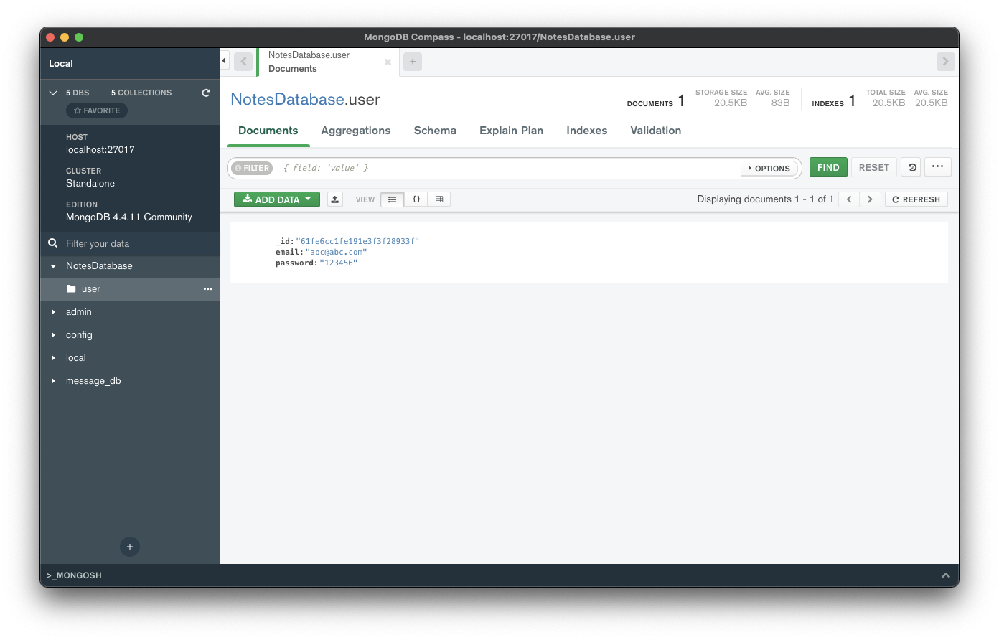

# Setting up MongoDB

다음과 같은 이유로 SQL 대신 NoSQL을 선택하였다.

## SQL vs NoSQL

- NoSQL databases save their data usually as key-value pairs or as collections of documents
- MongoDB saves data in collections of documents
- NoSQL DBs are usually faster
- SQL DBs have more control over queries
- NoSQL schemes are easily changable

Ktor는 Room 디비를 구현하는 것보다 MongoDB로 작성하는 것이 더 간단하다.

## Database Implementation

`src` 에 `data` 패키지를 생성한 후 `NotesDatabase` 파일을 생성한다. 이 파일에서 디비와 관련된 모든 것들을 처리한다. 지금은 빈 상태로 놓고 collection을 구현한 후 작성하자.

`data` 패키지 하위에 `collections` 패키지를 생성한 후 `Note` data class를 작성한다.

```kotlin
data class Note(
        val title: String,
        val content: String,
        val date: Long, // timestamp로 디비에 저장하면 효율적으로 저장 가능
        val owners: List<String>,
        val color: String,
        @BsonId // binary representation of json -> Bson
        val id: String = ObjectId().toString()  // generate random id
)
```

`collections` 패키지에 `User` data class도 작성해준다.

```kotlin
data class User(
        val email: String,
        val password: String,
        @BsonId
        val id: String = ObjectId().toString()
)
```

이제 `NotesDatabase`에 유저를 등록하는 `registerUser` 구현해보자.

```kotlin
private val client = KMongo.createClient().coroutine // 모든 디비 연산에 대해 코루틴 사용
private val database = client.getDatabase("NotesDatabase")
private val users = database.getCollection<User>()
private val notes = database.getCollection<Note>()

suspend fun registerUser(user: User): Boolean {
    return users.insertOne(user).wasAcknowledged()
}
```

`registerUser()`가 정상적으로 동작하는지 확인하기 위해 `Application`에 다음과 같이 코드를 추가한다.

```kotlin
@Suppress("unused") // Referenced in application.conf
@kotlin.jvm.JvmOverloads
fun Application.module(testing: Boolean = false) {
    // ...
    CoroutineScope(Dispatchers.IO).launch {
        registerUser(
                User(
                        "abc@abc.com",
                        "123456"
                )
        )
    }
}
```

그리고 서버를 시작하면 디비에 위에 전달한 유저가 저장되는 것을 확인할 수 있다.

```
2022-02-05 21:25:37.434 [Thread-8] DEBUG org.mongodb.driver.protocol.command - Sending command '{"insert": "user", "ordered": true, "$db": "NotesDatabase", "documents": [{"email": "abc@abc.com", "password": "123456", "_id": "61fe6cc1fe191e3f3f28933f"}]}' with request id 4 to database NotesDatabase on connection [connectionId{localValue:2, serverValue:3}] to server localhost:27017
```

정확한 확인을 위해 Compass를 열어 확인해보자. 저장된 유저를 확인할 수 있다.

<div align="center">

</div>