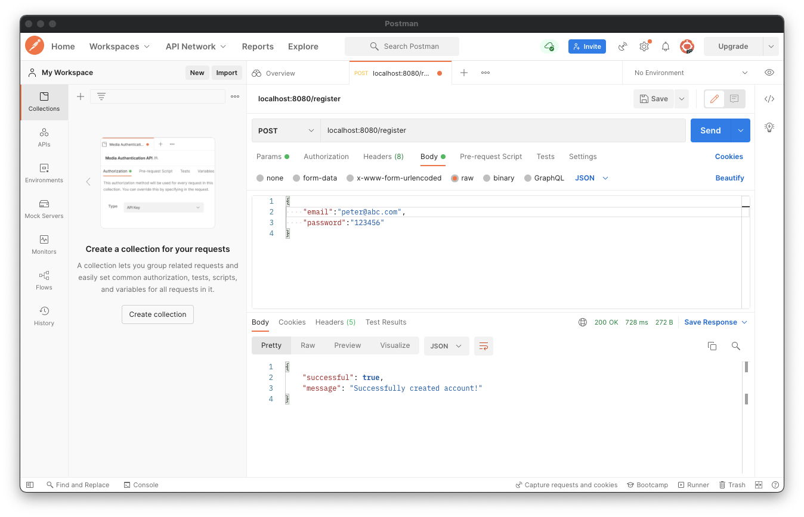
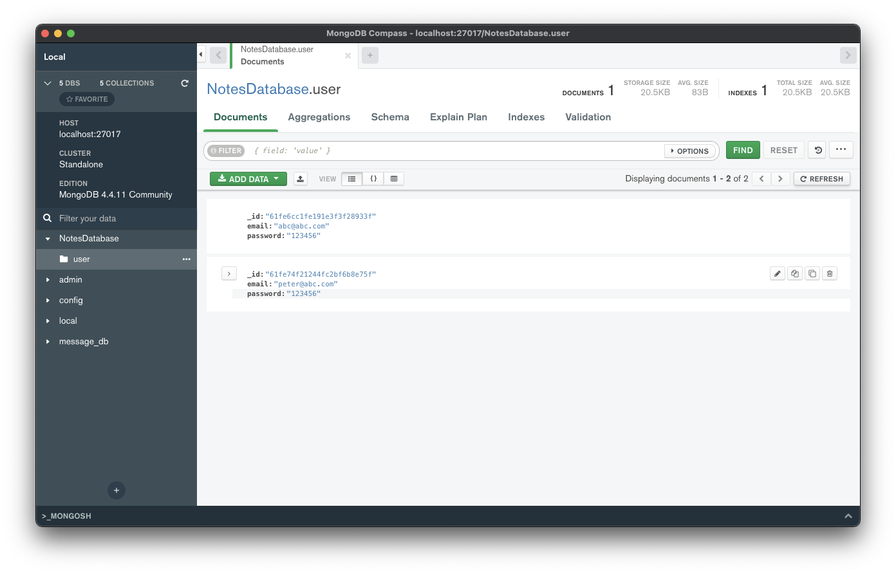

# Registering users

이전에 `Application`에 유저를 등록하기 위해 작성한 `registerUser()` 코드를 제거해주자.

클라이언트로부터 유저를 등록하기 위한 요청이 들어왔을 때 위 함수를 실행해야 한다. 만약 이메일이 이미 등록되어 있다면 등록이 실패했다는 응답을 해주어야 한다.

`NotesDatabase`를 다음과 같이 작성한다.

```kotlin
// ...
suspend fun registerUser(user: User): Boolean {
    return users.insertOne(user).wasAcknowledged()
}

suspend fun checkIfUserExists(email: String): Boolean {
    // SQL -> SELECT * FROM user WHERE email = $email
    return users.findOne(User::email eq email) != null
}
```

우선 유저 등록에 대한 요청과 응답을 작성한다. `data` 패키지에 `requests` 패키지를 생성 및 `AccountRequest` 파일 생성 후 다음과 같이 작성한다.

```kotlin
data class AccountRequest(
        val email: String,
        val password: String
)
```

`data` 패키지에 `responses` 패키지를 생성 및 `SimpleResponse` 파일 생성 후 다음과 같이 작성한다.

```kotlin
data class SimpleResponse(
        val successful: Boolean,
        val message: String
)
```

URL을 통해 유저를 등록할 수 있도록 구현하기 위해 `routes` 패키지를 생성하고 하위에 `RegisterRoute.kt` 파일 생성 후 작성한다.

```kotlin
fun Route.registerRoute() {
    route("/register") {
        post {
            val request = try {
                call.receive<AccountRequest>()
            } catch (e: ContentTransformationException) {
                call.respond(HttpStatusCode.BadRequest)
                return@post
            }
            val userExists = checkIfUserExists(request.email)
            if (!userExists) {
                if (registerUser(User(request.email, request.passwrod))) {
                    call.respond(HttpStatusCode.OK, SimpleResponse(true, "Successfully created account!"))
                } else {
                    call.respond(HttpStatusCode.OK, SimpleResponse(false, "An unknown error occured"))
                }
            } else {
                call.respond(HttpStatusCode.OK, SimpleResponse(false, "A user with that email already exists"))
            }
        }
    }
}
```

그리고 `Application.module`의 `install(Routing)` 블럭에 `registerRoute()`를 추가한다.

```kotlin
@Suppress("unused") // Referenced in application.conf
@kotlin.jvm.JvmOverloads
fun Application.module(testing: Boolean = false) {
    // ...
    install(Routing) {  // 클라이언트들이 연결할 수 있는 URL Endpoints
        registerRoute()
    }
    // ...
}
```

서버를 재시작 한 후 위 API를 테스트해보자. postman을 사용한다. 다음과 같이 유저 등록 요청을 작성한 후 Send 하면 응답을 받을 수 있다.

<div align="center">

</div>

`CallLogging` feature를 사용해서 다음과 같이 POST 요청에 대한 로그가 남는다.

```
2022-02-05 22:00:34.146 [eventLoopGroupProxy-4-2] TRACE Application - 200 OK: POST - /register
```

그리고 MongoDB를 확인해보면 등록 요청한 유저의 정보가 있음을 확인할 수 있다.

<div align="center">

</div>