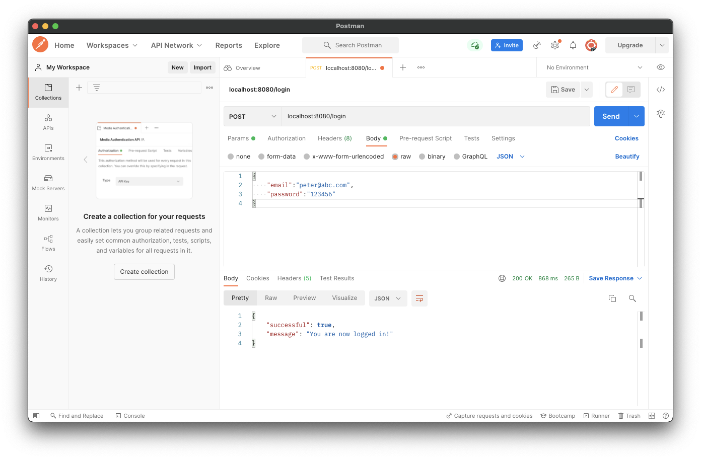
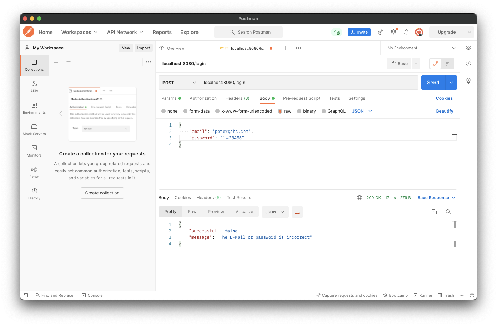

# Logging in users

이번엔 등록된 유저가 로그인을 할 수 있는 기능을 만들어보자.

먼저 `NotesDatabase`에 이메일에 대한 비밀번호를 검증하는 함수를 만든다.

```kotlin
// ...
suspend fun checkPasswordForEmail(email: String, passwordToCheck: String): Boolean {
    val actualPassword = users.findOne(User::email eq email)?.password ?: return false
    return actualPassword == passwordToCheck
}
```

`routes` 패키지에 `loginRoute` 파일을 생성한 후 다음과 같이 작성해준다.

```kotlin
fun Route.loginRoute() {
    route("/login") {
        post {
            val request = try {
                call.receive<AccountRequest>()
            } catch (e: ContentTransformationException) {
                call.respond(HttpStatusCode.BadRequest)
                return@post
            }
            val isPasswordCorrect = checkPasswordForEmail(request.email, request.password)
            if (isPasswordCorrect) {
                call.respond(HttpStatusCode.OK, SimpleResponse(true, "You are now logged in!"))
            } else {
                call.respond(HttpStatusCode.OK, SimpleResponse(false, "The E-Mail or password is incorrect"))
            }
        }
    }
}
```

그리고 `Application.module`의 `install(Routing)` 블럭에 `loginRoute()`를 추가한다.

```kotlin
@Suppress("unused") // Referenced in application.conf
@kotlin.jvm.JvmOverloads
fun Application.module(testing: Boolean = false) {
    // ...
    install(Routing) {  // 클라이언트들이 연결할 수 있는 URL Endpoints
        // ...
        loginRoute()
    }
    // ...
}
```

이전에 등록한 유저의 이메일과 비밀번호를 입력해 로그인을 수행하면 정상적으로 로그인 된 것을 확인할 수 있다.

<div align="center">

</div>

비밀번호를 다르게 입력한 경우 로그인이 정상적으로 수행되지 않음 확인할 수 있다.

<div align="center">

</div>