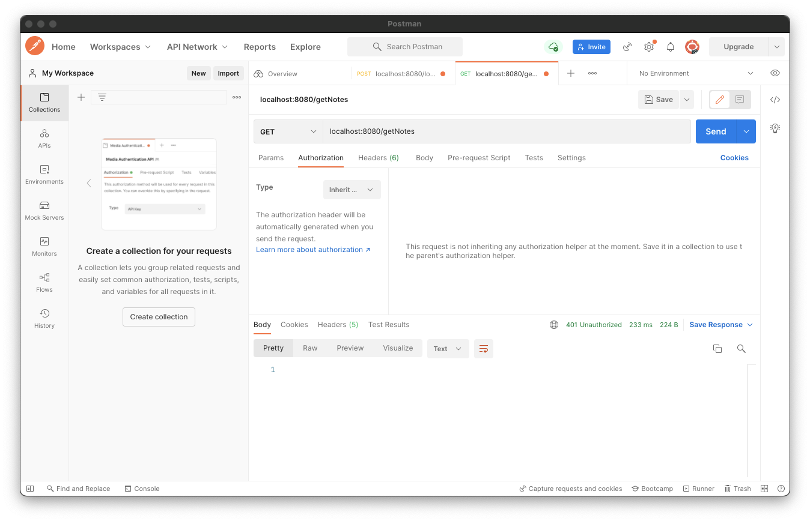
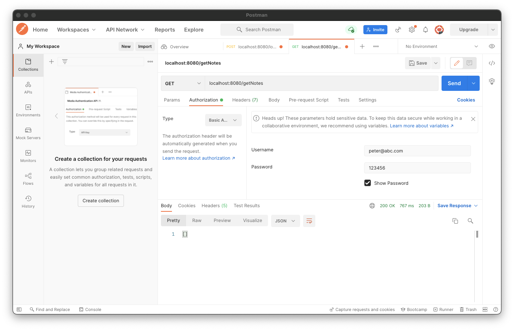

# Getting notes for a user

검증된 유저에게 해당하는 Note에 대한 정보를 전달하도록 구현해보자.

먼저 `NotesDatabase`에 `email`에 대한 유저에 대한 모든 Note를 반환하는 함수를 작성한다.

```kotlin
// ...
suspend fun getNotesForUser(email: String): List<Note> {
    return notes.find(Note::owners contains email).toList()
}
```

그리고 `routes` 패키지에 `NoteRoutes.kt`를 생성하고 `Route.noteRoutes()` 함수를 작성해준다. Note에 관련한 모든 Route는 이 파일에서 이루어진다.

```kotlin
fun Route.noteRoutes() {
    route("/getNotes") {
        // only authenticated user access
        authenticate {
            // UserIdPrincipal에 userId가 저장되므로 get 이용
            get {
                val email = call.principal<UserIdPrincipal>()!!.name

                val notes = getNotesForUser(email)
                call.respond(HttpStatusCode.OK, notes)
            }
        }
    }
}
```

그리고 다음과 같이 `Application.module`을 구현해준다.

```kotlin
@Suppress("unused") // Referenced in application.conf
@kotlin.jvm.JvmOverloads
fun Application.module(testing: Boolean = false) {
    // ...
    install(Authentication) {
        configureAuth()
    }
    // noteRoutes에 Authentication feature를 사용하기 때문에 Authentication feature 아래에 구현
    install(Routing) {  // 클라이언트들이 연결할 수 있는 URL Endpoints
        registerRoute()
        loginRoute()
        noteRoutes()
    }
}
// ...
```

이제 구현된 인증 로직 및 Note를 가져오는 API을 테스트해보자. Auth를 수행하지 않고 `/getNotes`를 요청한 경우 서버는 401 응답을 반환한다.

<div align="center">

</div>

인증 수행 후 `/getNotes` 요청한 경우 Ktor 서버에서 500 에러가 발생한다. Ktor 버전의 문제이며 1.4.1로 다운그레이드하면 정상적으로 동작한다.

<div align="center">

</div>