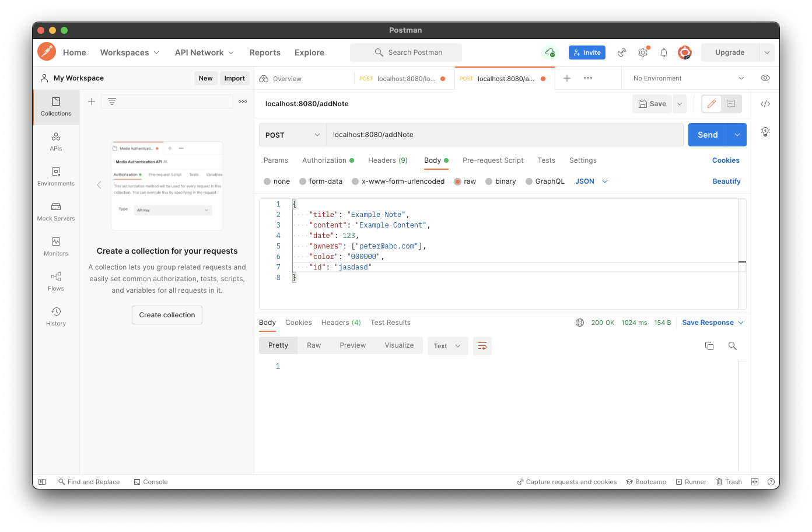
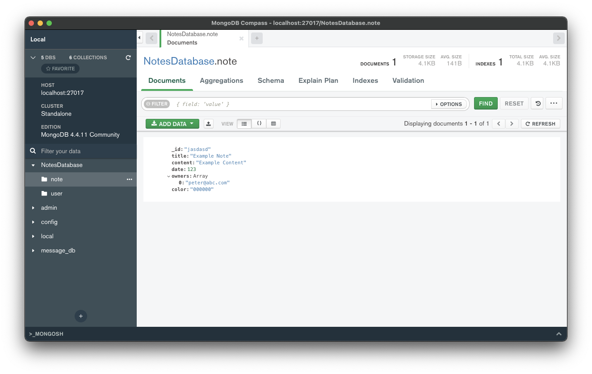
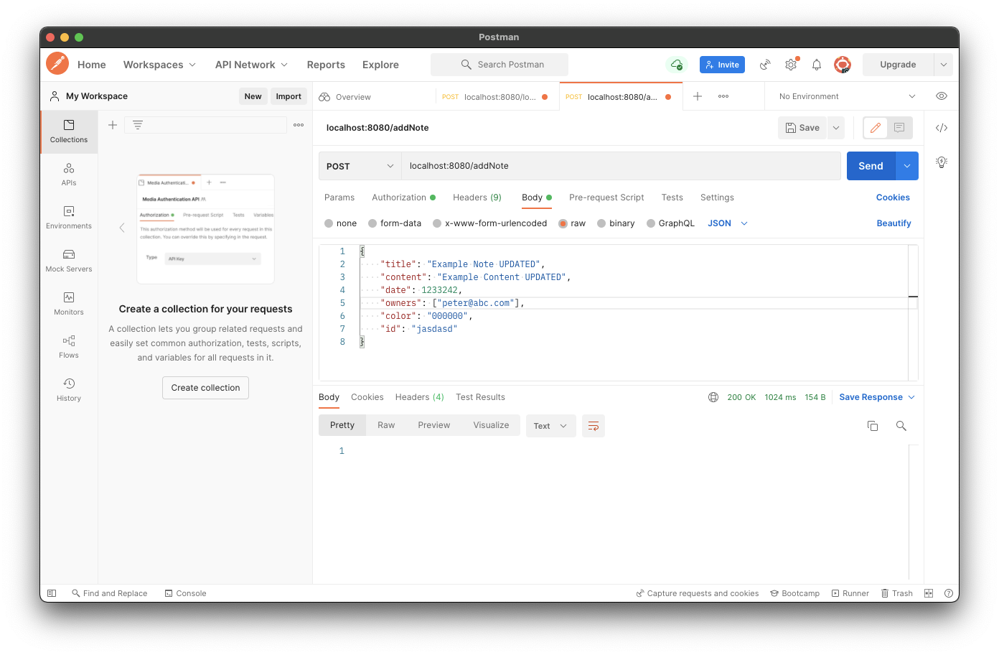
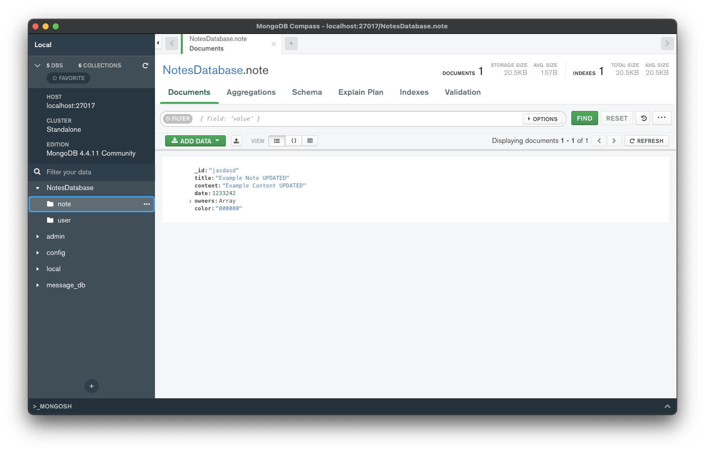

# Adding and updating notes

이제 검증된 유저가 Note를 입력하면 이를 서버에 저장하도록 구현해보자. Note가 이미 존재한다면 이 Note를 업데이트 하도록 할 것이다.

우선 `NotesDatabase`에 전달된 Note를 저장하는 함수를 구현한다.

```kotlin
// ...
suspend fun saveNote(note: Note): Boolean {
    val noteExists = notes.findOneById(note.id) != null
    return if (noteExists) {
        notes.updateOneById(note.id, note).wasAcknowledged()
    } else {
        notes.insertOne(note).wasAcknowledged()
    }
}
```

그리고 `NoteRoutes` 파일에 다음과 같이 `/addNote` Route를 추가한다.

```kotlin
fun Route.noteRoutes() {
    // ...
    route("/addNote") {
        authenticate {
            post {
                val note = try {
                    call.receive<Note>()
                } catch (e: ContentTransformationException) {
                    call.respond(HttpStatusCode.BadRequest)
                    return@post
                }
                if (saveNote(note)) {
                    call.respond(HttpStatusCode.OK)
                } else {
                    call.respond(HttpStatusCode.Conflict)
                }
            }
        }
    }
}
```

Postman으로 Note를 추가하는 테스트를 수행해보자. Authenticate가 된 상태여야 한다. 정상(200) 응답을 확인할 수 있으며, MongoDB를 보면 Note가 저장된 것을 확인할 수 있다.

<div align="center" class="column">
<div></div>
<div></div>
</div>

이번엔 저장된 Note를 업데이트하는 로직을 테스트해보자. `id`는 그대로 두고, 일부를 변경하여 요청하면 변경된 내용이 정상적으로 저장됨을 확인할 수 있다.

<div align="center" class="column">
<div></div>
<div></div>
</div>