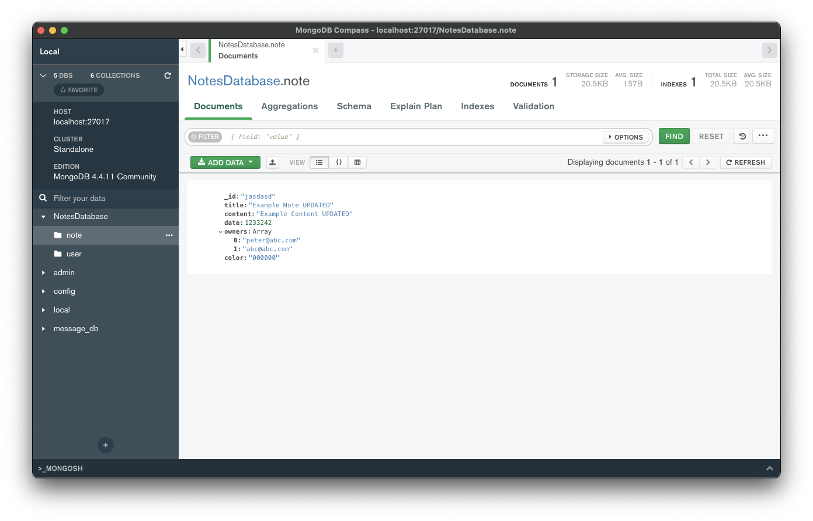
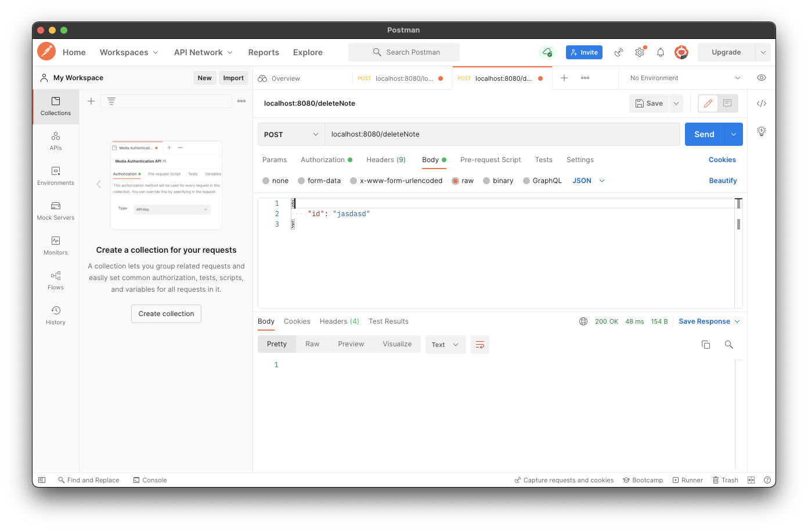
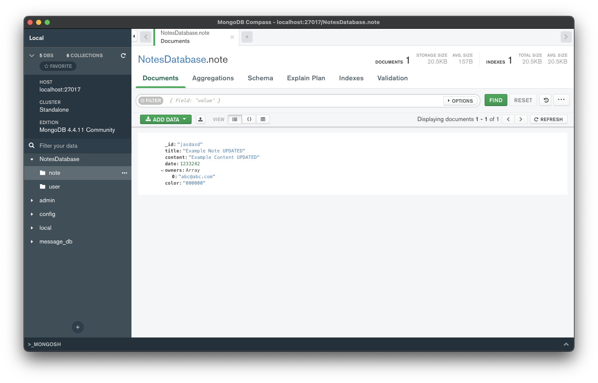

# Deleting notes

이번엔 Note를 삭제하는 기능을 구현해보자. Note를 소유한 Owner 만이 Note를 삭제할 수 있다.

`NotesDatabase`에 Note를 삭제하는 함수를 작성한다. Owner가 두 명 이상이면 삭제를 요청한 Owner에게만 삭제되며, Owner가 1명이라면 Note 자체를 삭제한다.

```kotlin
// ...
suspend fun deleteNoteForUser(email: String, noteID: String): Boolean {
    val note = notes.findOne(Note::id eq noteID, Note::owners contains email)
    note?.let { note ->
        if (note.owners.size > 1) {
            // the note has multiple owners, so we just delete the email from the owners list
            val newOwners = note.owners - email
            val updateResult = notes.updateOne(Note::id eq note.id, setValue(Note::owners, newOwners))
            return updateResult.wasAcknowledged()
        }
        // only 1 owner exists
        return notes.deleteOneById(note.id).wasAcknowledged()
    } ?: return false
}
```

이 삭제에 대한 요청을 `requests` 패키지에 생성 및 작성한다.

```kotlin
data class DeleteNoteRequest(
        val id: String
)
```

그리고 `Route.noteRoutes()`에 `/deleteNote` Route를 작성해준다.

```kotlin
fun Route.noteRoutes() {
    // ...
    route("/deleteNote") {
        authenticate {
            post {
                val email = call.principal<UserIdPrincipal>()!!.name
                val request = try {
                    call.receive<DeleteNoteRequest>()
                } catch (e: ContentTransformationException) {
                    call.respond(HttpStatusCode.BadRequest)
                    return@post
                }
                if (deleteNoteForUser(email, request.id)) {
                    call.respond(HttpStatusCode.OK)
                } else {
                    call.respond(HttpStatusCode.Conflict)
                }
            }
        }
    }
    // ...
}
```

Owner에게만 지워지는지 확인하기 위해 Note에 2명의 Owner를 추가한다.

<div align="center">

</div>

Postman을 통해 peter@abc.com으로 로그인 한 후 해당 유저에게서만 Note를 삭제해보면 peter@abc.com 유저만 삭제된 것을 확인할 수 있다.

<div align="center" class="column">
<div></div>
<div></div>
</div>

Note document를 삭제하기 위해 abc@abc.com 유저로 로그인한 후 다시 `/deleteNote`를 요청하면 정상적으로 document가 삭제되는 것을 확인할 수 있다.