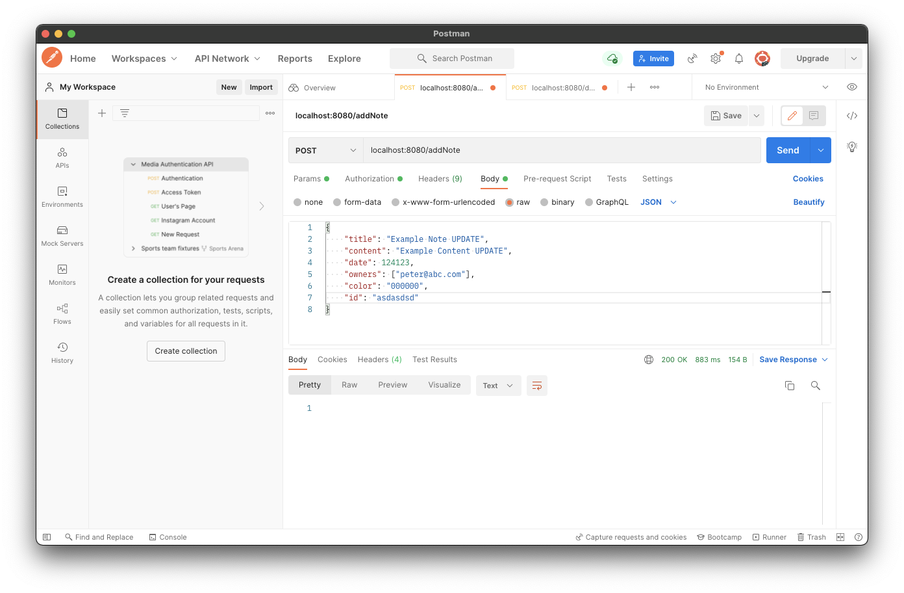
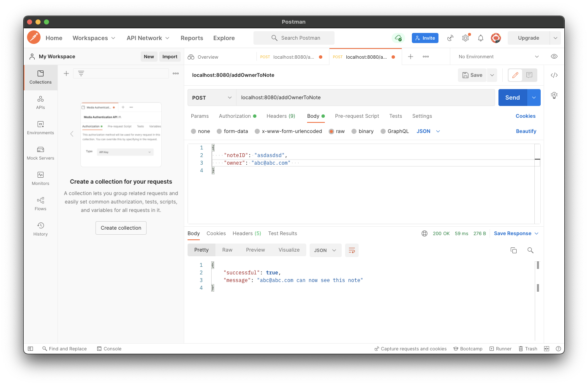
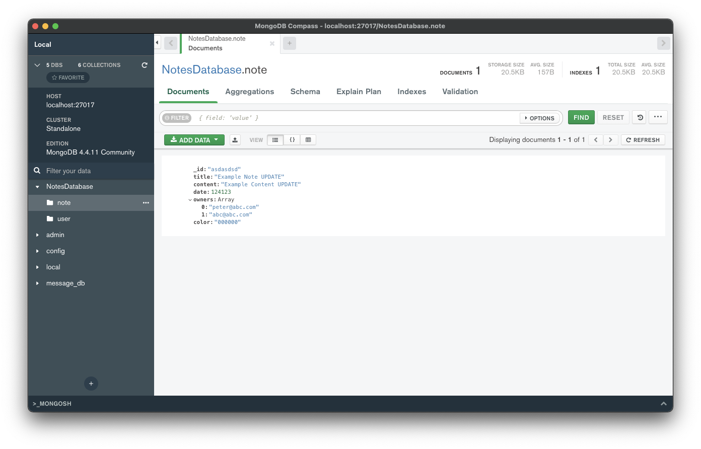

# Adding owners to notes

이번엔 Note에 대한 Owner를 추가하는 기능을 구현해보자.

`NotesDatabase`에 이미 Note에 Owner가 존재하는지 확인하는 함수 및 Note에 Owner를 추가하는 함수를 작성한다.

```kotlin
// ...
suspend fun isOwnerOfNote(noteId: String, owner: String): Boolean {
    val note = notes.findOneById(noteId) ?: return false
    return owner in note.owners
}

suspend fun addOwnerToNote(noteID: String, owner: String): Boolean {
    val owners = notes.findOneById(noteID)?.owners ?: return false
    return notes.updateOneById(noteID, setValue(Note::owners, owners + owner)).wasAcknowledged()
}
```

이 요청을 수행하기 위한 새로운 요청 data class가 필요하므로 `requests` 패키지에 `AddOwnerRequest.kt` 파일을 생성한 후 다음과 같이 작성한다.

```kotlin
data class AddOwnerRequest(
        val noteID: String,
        val owner: String
)
```

그리고 `Route.noteRoutes()`에 Note에 Owner를 추가하는 Route를 구현한다.

```kotlin
fun Route.noteRoutes() {
    // ...
    route("/addOwnerToNote") {
        authenticate {
            post {
                val request = try {
                    call.receive<AddOwnerRequest>()
                } catch (e: ContentTransformationException) {
                    call.respond(HttpStatusCode.BadRequest)
                    return@post
                }
                // user is exists
                if (!checkIfUserExists(request.owner)) {
                    call.respond(
                            HttpStatusCode.OK,
                            SimpleResponse(false, "No user with this E-Mail exists")
                    )
                    return@post
                }
                // check if owner of note is exists
                if (isOwnerOfNote(request.noteID, request.owner)) {
                    call.respond(
                            HttpStatusCode.OK,
                            SimpleResponse(false, "This user is already an owner of this note")
                    )
                    return@post
                }
                // add user to note
                if (addOwnerToNote(request.noteID, request.owner)) {
                    call.respond(
                            HttpStatusCode.OK,
                            SimpleResponse(true, "${request.owner} can now see this note")
                    )
                } else {
                    call.respond(HttpStatusCode.Conflict)
                }
            }
        }
    }
}
```

Postman을 통해 Owner 추가가 정상적으로 동작하는지 확인해보자. 먼저 Note를 추가한다.

<div align="center">

</div>

그 후 Note의 Owner에 abc@abc.com 추가하도록 요청하면 다음과 같이 정상적으로 추가되는 것을 확인할 수 있다.

<div align="center">

</div>

다시 한 번 보내게 되면 이미 Note의 Owner라는 메시지를 받는다.

<div align="center">

</div>

MongoDB를 보면 abc@abc.com 유저가 정상적으로 추가된 것을 확인할 수 있다.

<div align="center">

</div>