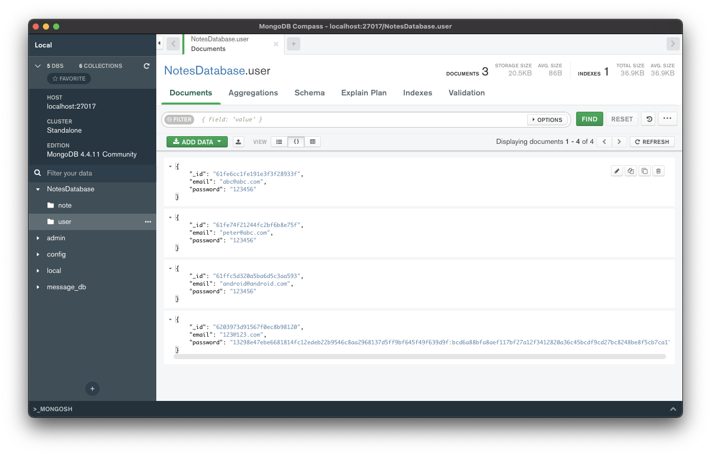

# Securely saving passwords

비밀번호를 DB에 평문으로 저장하는 것은 보안적으로 위험하므로 비밀번호를 해싱하여 저장하는 것을 추천한다. 비밀번호에 대해 해싱을 수행하면 원본 비밀번호를 얻기 어렵게 된다.

유저가 아이디를 등록하면 비밀번호의 해시를 수행하고 DB에 저장한다. salt를 해싱하기 전 비밀번호에 추가한다. 이 salt는 클라이언트, 서버에 저장되어 있어야 한다. salt를 사용하면 동일한 비밀번호에 대해
같은 해시 값이 나오지 않아 레인보우 테이블 공격에 대해 방어할 수 있다.

## Ktor

### PasswordUtility

`security` 패키지를 만든 후 `PasswordUtility.kt` 파일을 생성한다.

```kotlin
fun getHashWithSalt(stringToHash: String, saltLength: Int = 32): String {
    val salt = SecureRandom.getInstance("SHA1PRNG").generateSeed(saltLength)
    val saltAsHex = Hex.encodeHexString(salt)
    val hash = DigestUtils.sha256Hex("${saltAsHex}${stringToHash}")
    return "${saltAsHex}:${hash}"
}

fun checkHashForPassword(password: String, hashWithSalt: String): Boolean {
    val hashAndSalt = hashWithSalt.split(":")
    val salt = hashAndSalt[0]
    val hash = hashAndSalt[1]
    val passwordHash = DigestUtils.sha256Hex("${salt}${password}")
    return hash == passwordHash
}
```

### RegisterRoute

비밀번호 저장 시 `getHashWithSalt()` 함수를 사용한다.

```kotlin
fun Route.registerRoute() {
    route("/register") {
        post {
            val request = try {
                call.receive<AccountRequest>()
            } catch (e: ContentTransformationException) {
                call.respond(BadRequest)
                return@post
            }
            val userExists = checkIfUserExists(request.email)
            if (!userExists) {
                if (registerUser(User(request.email, getHashWithSalt(request.password)))) {
                    call.respond(OK, SimpleResponse(true, "Successfully created account!"))
                } else {
                    call.respond(OK, SimpleResponse(false, "An unknown error occured"))
                }
            } else {
                call.respond(OK, SimpleResponse(false, "A user with that E-Mail already exists"))
            }
        }
    }
}
```

### NotesDatabase

비밀번호를 검증할 때 `checkHashForPassword()` 함수를 사용한다.

```kotlin
// ...
suspend fun checkPasswordForEmail(email: String, passwordToCheck: String): Boolean {
    val actualPassword = users.findOne(User::email eq email)?.password ?: return false
    return checkHashForPassword(passwordToCheck, actualPassword)
}
// ...
```

123@123.com 계정을 생성하면 비밀번호가 해싱되어 들어가는 것을 확인할 수 있다.

<div align="center">

</div>