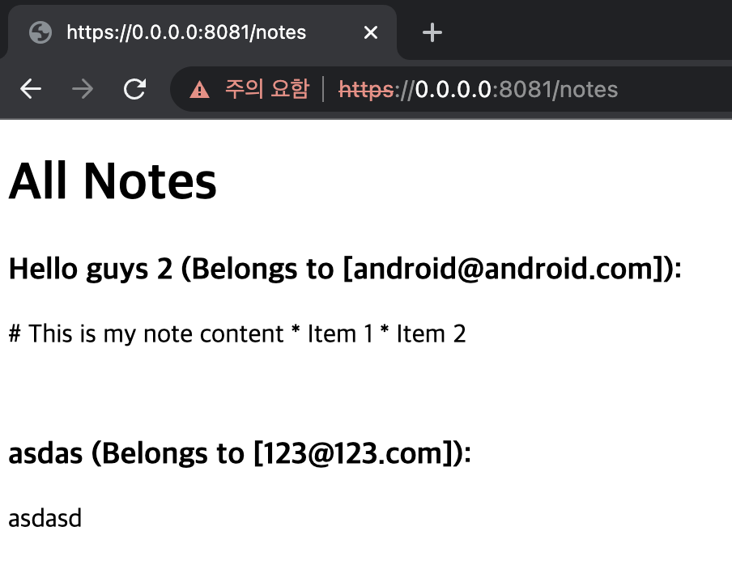

# Using Ktor to build websites

이번엔 간단한 웹사이트를 만들어본다. html 코드를 통해 모든 노트를 확인할 수 있도록 구현해보자.

### NotesDatabase

`NotesDatabase`에 모든 Note를 반환하는 `getAllNotes()` 함수를 작성해준다.

```kotlin
// ...
suspend fun getAllNotes(): List<Note> {
    return notes.find().toList()
}
// ...
```

### NoteRoute

모든 Note를 반환하는 `/notes` route를 작성해준다.

```kotlin
fun Route.noteRoutes() {

    route("/notes") {
        authenticate {
            get {
                val allNotes = getAllNotes()
                call.respondHtml {
                    body {
                        h1 {
                            +"All Notes"
                        }
                        for (note in allNotes) {
                            h3 {
                                +"${note.title} (Belongs to ${note.owners}):"
                            }
                            p {
                                +note.content
                            }
                            br
                        }
                    }
                }
            }
        }
    }
    // ...
}
```

그리고 http://localhost:port/notes로 접속하면 인증서 관련 에러가 발생하는데, `thisisunsafe`를 눌러주면 접속할 수 있다. 로그인 후 다음과 같은 Note를 확인할 수 있다.

<div align="center">

</div>