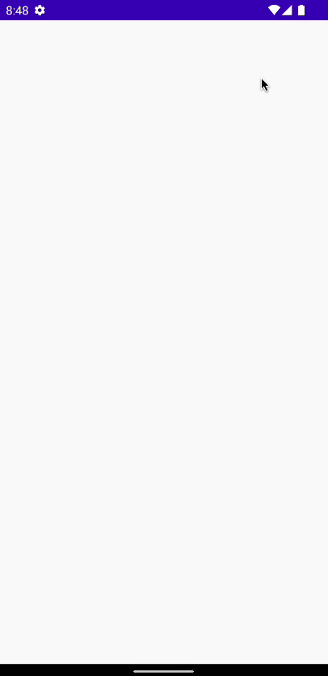

# Clean Flow Transformations with Combine, Zip & Merge

코틀린 Flow의 3가지 Combine, Zip, Merge 연산자에 대해 차이점, 언제 사용하는지 등을 알아보자.

다음 3개의 클래스가 있다고 가정하자.

```kotlin
data class User(
    val username: String? = null,
    val description: String? = null,
    val profilePicUrl: String? = null
)
```

```kotlin
data class Post(
    val imageUrl: String? = null,
    val username: String? = null,
    val description: String? = null
)
```

```kotlin
data class ProfileState(
    val profilePicUrl: String? = null,
    val username: String? = null,
    val description: String? = null,
    val posts: List<Post> = emptyList()
)
```

## Combine

`MainViewModel`에서 `user`와 `posts` flow를 합치기 위해 `combine` 연산자를 사용한다. 둘 중 하나라도 변경되면 `_profileState`가 업데이트 된다.

```kotlin
class MainViewModel : ViewModel() {

    private val user = MutableStateFlow<User?>(null)
    private val posts = MutableStateFlow(emptyList<Post>())

    private val _profileState = MutableStateFlow<ProfileState?>(null)
    val profileState = _profileState.asStateFlow()

    init {
        // user 또는 posts가 업데이트 되었을 때 combine 연산자를 통해 _profileState를 업데이트 한다.
        user.combine(posts) { user, posts ->
            _profileState.value = _profileState.value?.copy(
                profilePicUrl = user?.profilePicUrl,
                username = user?.username,
                description = user?.description,
                posts = posts
            )
        }.launchIn(viewModelScope)

//        // 위 코드는 아래의 코드와 동일하다.
//        viewModelScope.launch {
//            user.combine(posts) { user, posts ->
//                _profileState.value = _profileState.value.copy(
//                    profilePicUrl = user?.profilePicUrl,
//                    username = user?.username,
//                    description = user?.description,
//                    posts = posts
//                )
//            }.collect()
//        }
    }
}
```

만약 현재 유저가 로그인되었는지에 대한 Boolean 상태인 3번째 flow가 있다고 가장하자. `isAuthenticated` flow를 통해 유저가 로그인되었는지 확인하고 그 다음 유저가 로그인 된
경우 `_profileState`를 업데이트 한다.

```kotlin
class MainViewModel : ViewModel() {

    private val isAuthenticated = MutableStateFlow(true)
    private val user = MutableStateFlow<User?>(null)
    private val posts = MutableStateFlow(emptyList<Post>())

    private val _profileState = MutableStateFlow<ProfileState?>(null)
    val profileState = _profileState.asStateFlow()

    init {
        isAuthenticated.combine(user) { isAuthenticated, user ->
            if (isAuthenticated) user else null
        }.combine(posts) { user, posts ->
            user?.let {
                _profileState.value = _profileState.value?.copy(
                    profilePicUrl = user.profilePicUrl,
                    username = user.username,
                    description = user.description,
                    posts = posts
                )
            }
        }.launchIn(viewModelScope)
    }
}
```

## Zip

다음과 같이 2개의 flow가 있고, 각각 다른 delay로 emit하도록 구현한다. `zip` 연산자의 경우 둘 모두 emit 될 때까지 기다린 후 모두 emit 되면 코드 블록을 수행한다.

```kotlin
class MainViewModel : ViewModel() {

    // ...

    private val flow1 = (1..10).asFlow().onEach { delay(1000L) }
    private val flow2 = (10..20).asFlow().onEach { delay(300L) }
    var numberString by mutableStateOf("")
        private set

    init {
        flow1.zip(flow2) { number1, number2 ->
            // flow1과 flow2의 emission을 기다린 후 둘 모두 emit 된 경우 다음 코드를 수행한다.
            numberString += "(${number1}, ${number2})\n"
        }.launchIn(viewModelScope)
    }
}
```

flow1의 emit이 10이되어 끝나면, flow2의 경우 마지막(20)이 남아있는데, 이는 flow1에서 emit되지 않기 때문에 대기하게 된다.

<div align="center">

</div>

## Merge

`merge` 연산자의 경우 인자로 여러 flow를 전달할 수 있다. 인자로 전달된 flow가 emit 될 때마다 코드 블록을 수행한다.

```kotlin
@OptIn(ExperimentalCoroutinesApi::class)
class MainViewModel: ViewModel() {
    // ...

    private val flow1 = (1..10).asFlow().onEach { delay(1000L) }
    private val flow2 = (10..20).asFlow().onEach { delay(300L) }
    var numberString by mutableStateOf("")
        private set

    init {
        // ...

        merge(flow1, flow2).onEach {
            numberString += "$it\n"
        }.launchIn(viewModelScope)
    }
}
```

<div align="center">

</div>

## References

* [Clean Flow Transformations with Combine, Zip & Merge - Kotlin Flows](https://www.youtube.com/watch?v=JAjcSVmVmos&t=12s)