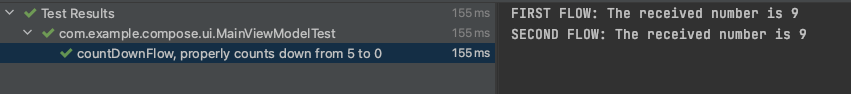
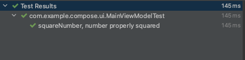
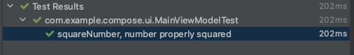

# Unit Testing Flows

Flow를 유닛 테스트하는 방법을 알아보자. Flow를 유닛 테스트하기 위해 다음 디펜던시를 추가한다.

```groovy
testImplementation 'app.cash.turbine:turbine:0.7.0' // flow test를 쉽게 만들어준다.
testImplementation "com.google.truth:truth:1.1.3"
testImplementation "org.jetbrains.kotlinx:kotlinx-coroutines-test:1.5.1"
```

이전에 구현했던 `countDownFlow`를 테스트해보자. 테스트 시 테스트 디스패처를 전달해주기 위해 `DispatcherProvider` 클래스를 생성한다.

```kotlin
interface DispatcherProvider {
    val main: CoroutineDispatcher
    val io: CoroutineDispatcher
    val default: CoroutineDispatcher
}

class DefaultDispatchers: DispatcherProvider {
    override val main: CoroutineDispatcher
        get() = Dispatchers.Main
    override val io: CoroutineDispatcher
        get() = Dispatchers.IO
    override val default: CoroutineDispatcher
        get() = Dispatchers.Default
}
```

그리고 각 코루틴 스코프마다 디스패처를 전달해준다.

```kotlin
class MainViewModel(
    private val dispatchers: DispatcherProvider
) : ViewModel() {

    // flow 블록 안에서 여러 값을 방출할 수 있으며 suspend 함수를 호출할 수 있다.
    val countDownFlow = flow<Int> {
        val startingValue = 5
        var currentValue = startingValue
        emit(startingValue)
        while (currentValue > 0) {
            delay(1000L)
            currentValue--
            // 원하는 값을 방출한다.
            emit(currentValue)
        }
    }.flowOn(dispatchers.main)

    private val _stateFlow = MutableStateFlow(0)
    val stateFlow = _stateFlow.asStateFlow()

    fun incrementCounter() {
        _stateFlow.value += 1
    }

    // replay: 5개의 emit를 캐시하고 새로운 컬렉터가 수집하는 경우 캐시 데이터를 전달
    private val _sharedFlow = MutableSharedFlow<Int>(replay = 5)
    val sharedFlow = _sharedFlow.asSharedFlow()

    fun squareNumber(number: Int) {
        viewModelScope.launch(dispatchers.main) {
            _sharedFlow.emit(number * number)
        }
    }

    init {
        squareNumber(3)
        viewModelScope.launch(dispatchers.main) {
            sharedFlow.collect {
                delay(2000L)
                println("FIRST FLOW: The received number is ${it}")
            }
        }
        viewModelScope.launch(dispatchers.main) {
            sharedFlow.collect {
                delay(3000L)
                println("SECOND FLOW: The received number is ${it}")
            }
        }
    }
    
    private fun collectFlow() {
        val flow = flow {
            delay(250L)
            emit("Appetizer")
            delay(1000L)
            emit("Main dish")
            delay(100L)
            emit("Dessert")
        }

        viewModelScope.launch(dispatchers.main) {
            flow
                .onEach {
                    println("FLOW: ${it} is delivered")
                }
                .collectLatest {
                    println("FLOW : Now eating ${it}")
                    delay(1500L)
                    println("FLOW: Finished eating ${it}")
                }
        }
    }
}
```

유닛 테스트를 수행하기 위해 `TestDispatchers`를 생성해준다.

```kotlin
@ExperimentalCoroutinesApi
class TestDispatchers: DispatcherProvider {
    val testDispatcher = TestCoroutineDispatcher()
    override val main: CoroutineDispatcher
        get() = testDispatcher
    override val io: CoroutineDispatcher
        get() = testDispatcher
    override val default: CoroutineDispatcher
        get() = testDispatcher
}
```

`MainViewModelTest`를 생성하여 `TestDispatchers()`를 ViewModel에 전달한다. 그 후 테스트 케이스를 작성하고 테스트를 수행한다.

```kotlin
@ExperimentalCoroutinesApi
class MainViewModelTest {

    private lateinit var viewModel: MainViewModel
    private lateinit var testDispatchers: TestDispatchers

    @Before
    fun setUp() {
        testDispatchers = TestDispatchers()
        viewModel = MainViewModel(testDispatchers)
    }

    @Test
    fun `countDownFlow, properly counts down from 5 to 0`() = runBlocking {
        viewModel.countDownFlow.test {
            for (i in 5 downTo 0) {
                testDispatchers.testDispatcher.advanceTimeBy(1000L)
                // item을 받기 전까지 블록을 suspend 한다.
                val emission = awaitItem()
                assertThat(emission).isEqualTo(i)
            }
						// 추가적인 이벤트가 들어오는 경우 예외를 발생하기 때문에 다음 함수를 추가한다.
            cancelAndConsumeRemainingEvents()
        }
    }
}
```

<div align="center">

</div>

다음은 `SharedFlow`를 테스트해보자. 이전 예제로 사용한 `squareNumber`를 테스트할 것이다. 수집된 후에 테스트를 수행해야 하기 때문에 `viewModel.squareNumber(3)`을 수집 후에 작성한다. 그럼

```kotlin
fun `squareNumber, number properly squared`() = runBlocking {
    viewModel.sharedFlow.test {
        val emission = awaitItem()
        assertThat(emission).isEqualTo(9)
    }
    viewModel.squareNumber(3)
}
```

<div align="center">

</div>

또 하나의 방법은 collector를 분리된 코루틴에 두는 것이다. 다음과 같이 구현하면 `launch` 블록은 suspend 되지 않고 독립적으로 동작하게 되어 동시적으로 수행할 수 있다.

```kotlin
@Test
fun `squareNumber, number properly squared`() = runBlocking {
    // job은 독립적으로 동작
    val job = launch {
        viewModel.sharedFlow.test {
            val emission = awaitItem()
            assertThat(emission).isEqualTo(9)
            cancelAndConsumeRemainingEvents()
        }
    }
    viewModel.squareNumber(3)
    job.join()
    job.cancel()
}
```

<div align="center">

</div>

## References

* [Unit Testing Flows - The Ultimate Guide to Kotlin Flows (Part 4)](https://www.youtube.com/watch?v=rk6aKkWqqcI&list=PLQkwcJG4YTCQHCppNAQmLsj_jW38rU9sC&index=4)