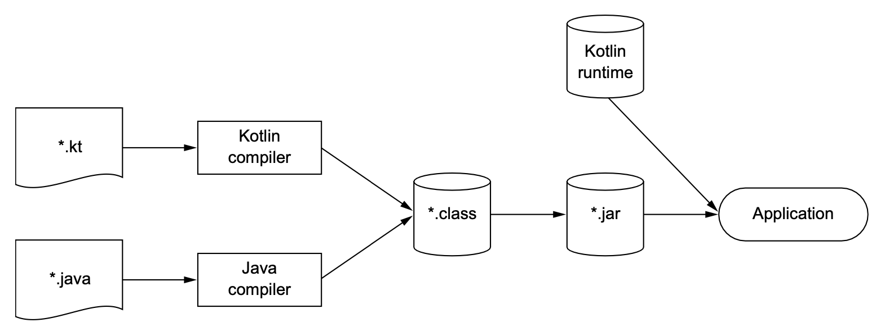

# Kotlin: what and why

코틀리은 자바 플랫폼에서 돌아가는 새로운 프로그래밍 언어다. 코틀린은 간단하고 실용적이며, 자바 코드와 상호운용성(interoperatbility)을 중시한다. 자바가 사용 중인 곳이라면 거의 대부분 코틀린을
활용할 수 있다. 자바 라이브러리나 프레임워크와 함께 잘 작동하며, 성능도 자바와 같은 수준이다.

## 1.1 코틀린 맛보기

`Person`이라는 클래스를 정의하고, 컬렉션을 생성하고, 나이가 많은 사람을 찾고, 결과를 출력한다. 이 코드에서 코틀린의 흥미로운 점들을 확인할 수 있다. 코드는 간략하게 설명한고, 상세한 설명은 추후 설명한다.

```kotlin
data class Person(val name: String, 
                  val age: Int? = null) // nullable type (Int?); the default value for the argument

fun main(args: Array<String>) {
    val persons = listOf(Person("Alice"), 
        Person("Bob", age = 29)) // Named argument
    
    val oldest = persons.maxBy { it.age ?: 0 } // Lambda expression ; Elvis operator
    println("The oldest is: $oldest")
}

// The oldest is: Person(name=Bob, age=29)  // Autogenerated toString
```

`name`과 `age` 속성을 갖는 간단한 데이터 클래스를 선언했다. `age` 속성은 기본적으로 `null`이다. `maxBy`를 이용해 가장 나이가 많은 사람을 찾았다. 람다 표현식은 하나의 파라미터를 받으며, `it`를 사용하면
람다 식의 유일한 인자를 사용할 수 있다. `Elvis` 연산자 (?:)은 `age`가 `null`이면 `zero`를 리턴한다. `age`가 지정되지 않았기 때문이다. 따라서 Bob이 가장 나이가 많은 사람이 된다.

## 1.2 코틀린의 주요 특성

### 1.2.1 대상 플랫폼: 서버, 안드로이드 등 자바가 실행되는 모든 곳

코틀린의 목적은 현재 자바가 사용되고 있는 모든 용도에 적합하면서도 더 간결하고, 더 생산적이며 안전한 언어를 제공하는 것이다. 코틀린을 도입하면 더 적은 코드로 더 편하게 프로그래머의 목표를 달성할 수 있을 것이다.

코틀린을 활용할 수 있는 가장 일반적인 영역은 다음과 같다.

* 서버상의 코드
* 안드로이드 디바이스에서 실행되는 모바일 애플리케이션

### 1.2.2 정적 타입 지정 언어

자바와 마찬가지로 코틀린도 정적 타입 언어이다. 이는 프로그램의 모든 표현식의 타입을 컴파일 타임에 알 수 있고, 객체의 메서드와 필드를 사용할 때마다 컴파일러가 타입을 검증해준다는 뜻이다.  

이런 점은 동적 타입 언어와는 다르다. JVM에서는 Groovy나 JRuby가 대표적이다. 동적 타입 언어는 타입과 관계없이 모든 값을 변수에 넣을 수 있고, 메소드나 필드 접근에 대한 검증이 런타임에 일어나며, 그에 따라
코드가 더 짧아지고 데이터 구조를 더 유연하게 생성하고 사용할 수 있다. 하지만 반대로 이름을 잘못 입력하는 등의 실수도 컴파일 시 걸러내지 못하고 런타임에 오류가 발생한다.

자바와 달리 코틀린에서는 명시적으로 모든 변수의 타입을 지정해주지 않아도 된다. 대부분의 경우 코틀린 컴파일러가 변수 타입을 자동으로 유추할 수 있기 때문이다. 

```kotlin
val x = 1
```

정적 타입 언어의 장점은 다음과 같다.

* 성능: 실행 시점에 어떤 메서드를 호출할지 알아내는 과정이 필요 없으므로 더 빠르다.
* 신뢰성: 컴파일러가 프로그램의 정확성을 검증하기 때문에 실행 시 프로그램 오류로 중단될 가능성이 더 적다.
* 유지보수성: 코드에서 다루는 객체가 어떤 타입에 속하는지 알 수 있기 때문에 처음 보는 코드를 다룰 때도 더 쉽다.
* 도구 지원: 정적 타입을 활용하면 더 안전하게 리팩토링 할 수 있고, 도구는 더 정확한 코드 완성 기능을 제공할 수 있으며, IDE의 다른 지원 기능도 더 잘 만들 수 있다.

코틀린은 타입 추론을 지원하므로 정적 타입 언어에서 프로그래머가 직접 타입을 선언해야 하는 불편함이 사라진다.

코틀린은 nullable 타입을 지원한다. 따라서 프로그램의 신뢰성을 더 높일 수 있다. 

코틀린의 타입 시스템에는 함수 타입(function type)에 대해 지원된다. 

### 1.2.3 함수형 프로그래밍과 객체지향 프로그래밍

* 일급 시민(first-class) 함수: 함수를 일반 값처럼 다룰 수 있다. 함수를 변수에 저장할 수 있고, 함수를 인자로 전달할 수 있으며, 함수에서 새로운 함수를 만들어 반환할 수 있다.
* 불변성(immutability): 함수형 프로그래밍에서는 일단 만들어지고 나면 내부 상태가 절대 바뀌지 않는 불변 객체를 사용해 프로그램을 작성한다.
* 사이드 이펙트 없음: 함수형 프로그래밍에서는 입력이 같은 항상 같은 출력을 내놓고 다른 객체의 상태를 변경하지 않으며, 외부나 바깥 환경과 상호작용하지 않는 순수 함수를 사용한다.

함수형 스타일로 프로그램을 작성하면 다음과 같은 이점을 얻을 수 있다.

1. 간결성
    * 함수를 값처럼 활용할 수 있으면 더 강력한 추상화를 할 수 있고, 이를 통해 코드 중복을 막을 수 있다.
2. 다중 스레드에서의 안정성
    * 불변 데이터 구조를 사용하고 순수 함수를 그 데이터 구조에 적용한다면 다중 스레드 환경에서 같은 데이터를 여러 스레드가 변경할 수 없다. 따라서 복잡한 동기화를 적용하지 않아도 된다.
3. 테스트
   * 사이드 이펙트가 있는 함수는 그 함수를 실행할 때 필요한 환경을 구성하는 setup 코드가 따로 필요하지만, 순수 함수는 준비 코드 없이 독립적으로 테스트할 수 있다.

코틀린은 처음부터 다음과 같이 지원해왔다.

* 함수 타입을 지원함에 따라 어떤 함수가 다른 함수를 파라미터로 받거나 함수가 새로운 함수를 반환할 수 있다.
* 람다 식을 지원함에 따라 번거로운 준비 코드를 작성하지 않아도 코드 블록을 쉽게 정의하고 여기저기 전달할 수 있다.
* 데이터 클래스는 불변적인 값 객체(value object)를 간편하게 만들 수 있는 구문을 제공한다.
* 코틀린 표준 라이브러리는 객체와 컬렉션을 함수형 스타일로 다룰 수 있는 API를 제공한다.

### 1.2.4 무료 오픈소스

코틀린 언어와 컴파일러, 라이브러리 및 코틀린과 관련된 모든 도구는 모두 오픈소스이며, 어떤 목적에든 무료로 사용할 수 있다.

* <https://github.com/JetBrains/kotlin>

## 1.3 코틀린 응용

### 1.3.1 코틀린 서버 프로그래밍

코틀린을 사용하면 기존 자바 프레임워크를 상호운용할 수 있다. 새로운 컴포넌트를 작성하거나 기존 서비스 코드를 코틀린으로 이식해야 하는 경우 모두 잘 들어맞는다. 자바 클래스를 코틀린으로
확장해도 아무 문제가 없으며, 메서드나 필드에 애노테이션을 붙여야 하는 경우도 문제가 없다. 코드는 더 간결해지고 신뢰성이 높아지며, 유지보수하기 쉬워질 것이다.

또한 몇 가지 새로운 기술을 활용해 서버 시스템을 개발할 수 있다. 코틀린의 빌더 패턴을 활용하면 간결한 구문을 사용해 객체로 이뤄진 그래프를 쉽게 구축하면서도 코틀린이 제공하는 완전한
추상화와 코드 재활용을 지속적으로 누릴 수 있다.

```kotlin
fun renderPersonList(persons: Collection<Person>) =
    createHTML().table {            // Functions that map to HTML tags
        for (person in persons) {
            tr {                    // Functions that map to HTML tags
                td { +person.name } // Functions that map to HTML tags
                td { +person.age }  // Functions that map to HTML tags
            }
        }
    }
```

HTML 태그로 변환될 함수와 일반 코틀린 언어 기능을 쉽게 조합할 수 있다. 

코틀린이 제공하는 깔끔하고 간결한 DSL 기능을 활용할 수 있는 다른 예로 presistence 프레임워크를 들 수 있다. 예를 들어, Exposed 프레임워크는 SQL 데이터베이스의 구조를 기술할 수 있는
읽기 쉬운 DSL을 제공하며, 코틀린 코드만을 사용해 완전한 타입 검사를 지원하면서 데이터베이스 질의를 수행할 수 있다.

```kotlin
object CountryTable : IdTable() {       // Describes a table in the database
    val name = varchar("name", 250).uniqueIndex()
    val iso = varchar("iso", 2).uniqueIndex()
}

class Country(id: EntityID) : Entity(id) {  // Creates a class corresponding to a database entity
    var name: String by CountryTable.name
    var iso: String by CountryTable.iso
}

val russia = Country.find {     // You can query this database using pure Kotlin code
    CountryTable.iso.eq("ru")
}.first()

println(russia.name)
```

### 1.3.2 코틀린 안드로이드 프로그래밍

코틀린 언어의 특성과 안드로이드 프레임워크의 특별한 컴파일러 플러그인 지원을 조합하면 안드로이드 애플리케이션 개발의 생산성을 더 높일 수 있다. 기존 코드보다 더 적은 코드로 만들 수 있고, 
때로는 전혀 코드를 작성하지 않아도 된다(컴파일러가 자동으로 코드를 생성). Anko 라이브러리를 사용하면 수많은 안드로이드 API에 대한 코틀린 어댑터를 제공받을 수 있다.

```kotlin
verticalLayout {
   val name = editText()        // Creates a simple text field
   button("Say Hello") {        // When clicked, this button displays the value of the text field
      onClick { toast("Hello, ${name.text}!") } // Concise APIs for attaching a listener and showing a toast
   }
}
```

코틀린 타입 시스템은 `null` 값을 정확히 추적하며 널 포인터로 인해 생기는 문제를 줄여준다. 

코틀린 컴파일러가 생성한 바이트코드는 일반적인 자바 코드와 똑같이 효율적으로 실행된다. 패키징한 애플리케이션 크기도 자바 애플리케이션에 비해 많이 늘어나지 않는다. 또한 대부분의 코틀린 표준 라이브러리
함수는 인자로 받은 람다 함수를 inlining한다. 따라서 람다를 사용해도 새로운 객체가 만들어지지 않으므로 객체 증가로 인한 GC가 늘어나지 않는다.

## 1.4 코틀린의 철학

### 1.4.1 실용성

코틀린은 실제 문제를 해결하기 위해 만들어진 실용적인 언어다. 설계는 다년간의 IT 업계 경험을 바탕으로 이루어졌으며, 수많은 개발자의 사용에 잘 들어맞을 수 있게 언어 특성을 선택했다. 게다가 코틀린 초기
버전을 사용하면서 전달한 피드백이 현재 발표된 최종 코트린에 반영돼 있다.

### 1.4.2 간결성

코틀린은 프로그래머가 작성하는 코드에서 의미가 없는 부분을 줄이고, 언어가 요구하는 구조를 만족시키기 위해 부수적인 요소를 줄이려고 노력했다. `getter`, `setter`, 생성자 파라미터를 필드에
대입하기 위한 로직 등 자바에 존재하는 여러 번거로운 준비 코드를 묵시적으로 제공하기 때문에 깔끔한 코드를 짤 수 있다.

코틀린은 람다를 지원하기 때문에 작은 코드 블록을 라이브러리 함수에 쉽게 전달할 수 있다. 따라서 일반적인 기능을 라이브러리 안에 캡슐화하고 작업에 따라 달라져야 하는 개별적인 내용을
사용자가 작성한 코드 안에 남겨둘 수 있다.

코드가 간결하면 쓰는 데 시간이 덜 걸리고, 읽는 데도 시간이 덜 걸린다. 간결성은 생산성을 향상시키고 개발을 더 빠르게 진행할 수 있게 해준다.

### 1.4.3 안전성

프로그램에서 발생할 수 있는 오류 중에서 일부 유형의 오류를 프로그램 설계가 원천적으로 방지해준다는 뜻이다.

코틀린은 정적 타입 언어로서 애플리케이션의 타입 안정성을 보장한다. 자바보다 더 적은 비용으로 타입 안정성을 사용할 수 있다. 코틀린은 타입을 자동으로 추론해주기 때문이다.

코틀린은 런타임에 오류를 발생시키는 대신 컴파일타임 검사를 통해 오류를 더 많이 방지해준다. 코틀린은 `null`이 될 수 없는 값을 추적하며, 런타임에 `NullPointerException`이 발생할 수 
있는 연산을 사용하는 코드를 금지한다. 

```kotlin
val s: String? = null   // May be null
val s2: String = ""     // May not be null
```

코틀린이 방지해주는 다른 예외로는 `ClassCastException`이 있다. 어떤 객체를 다른 타입으로 캐스트하기 전 타입을 미리 검사하지 않으면 `ClassCastException`이 발생할 수 있다. 
코틀린의 경우 타입 검사와 캐스트가 한 연산자에 의해 이뤄진다. 어떤 객체의 타입을 검사했고 그 객체가 그 타입에 속한다면 별도의 캐스트 없이 사용할 수 있다.

```kotlin
if (value is String)    // Checks the type
    println(value.toUpperCase())    // Uses the method of the type
```

### 1.4.4 상호운용성

자바 메서드를 호출하거나 자바 클래스를 상속(확장)하거나 인터페이스를 구현하거나 자바 애노테이션을 코틀린 코드에 적용하는 등의 작업이 모두 가능하다.

* 자바와 코틀린 소스 파일을 자유롭게 네비게이션 할 수 있다.
* 여러 언어로 이뤄진 프로젝트를 디버깅하고 서로 다른 언어로 작성된 코드를 언어와 관계없이 한 단계씩 실행할 수 있다.
* 자바 메서드를 리팩토링해도 그 메서드와 관련 있는 코틀린 코드까지 제대로 변경된다. 역으로 코틀린 메서드를 리팩토링해도 자바 코드까지 모두 자동으로 변경된다.

### 1.5 코틀린 도구 사용

### 1.5.1 코틀린 코드 컴파일

`kotlinc` 명령을 통해 코틀린 코드를 컴파일한 다음 `java` 명령으로 코드를 실행할 수 있다.

```shell
kotlinc <source file or directory> -include-runtime -d <jar name>
java -jar <jar name>
```

<div align="center">

</div>

컴파일한 코드는 코틀린 런타임 라이브러리에 의존한다. 런타임 라이브러리에는 코틀린 자체 표준 라이브러리 클래스와 코틀린에서 자바 API의 기능을 확장한 내용이 들어있다. 코틀린으로 컴파일한 
애플리케이션을 배포할 때는 런타임 라이브러리도 함께 배포해야 한다.

### 1.5.2 IntelliJ IDEA와 Android Studio의 코틀린 플러그인

IntelliJ IDEA의 코틀린 플러그인은 코틀린 언어와 함께 개발돼 왔으며, 코틀린을 사용할 수 있는 개발 환경 중에서 가장 다양한 기능을 제공한다. 코틀린 개발에 필요한 모든 도구를 제공하며
IntelliJ IDEA 15 이후 버전에는 기본적으로 포함돼 있다.

### 1.5.3 대화형 셸

아무 인자 없이 `kotlinc` 명령을 통해 실행하거나, IntelliJ IDEA의 플러그인 메뉴(Tools > Kotlin > Kotlin REPL)를 사용하면 된다.

### 1.5.4 이클립스 플러그인

이클립스 IDE에서 코틀린을 사용할 수 있다. 이클립스 마켓플레이스에서 코틀린 플러그인을 찾을 수 있다.

### 1.5.5 온라인 놀이터

웹상에서 코틀린 코드를 작성하고 컴파일한 다음 실행할 수 있는 [온라인 놀이터](http://try.kotl.in/)가 있다. 

### 1.5.6 자바-코틀린 변환기

이 도구는 자동으로 자바를 코틀린으로 변환한다. 

## 요약

* 코틀린은 타입 추론을 지원한다. 따라서 소스코드의 정확성과 성능을 보장하면서 소스코드를 간결하게 유지할 수 있다.
* 코틀린은 객체지향과 함수형 프로그래밍 스타일을 모두 지원한다. 코틀린에서는 일급 시민 함수를 사용해 수준 높은 추상화가 가능하고, 불변 값을 지원을 통해 다중 스레드 애플리케이션 개발과 테스트를 더 쉽게 할 수 있다.
* 코틀린을 서버 애플리케이션 개발에 잘 활용할 수 있다.
* 코틀린을 안드로이드에도 활용할 수 있다.
* 코틀린은 무료이며 오픈소스다. 주요 IDE와 빌드 시스템을 완전히 지원한다.
* 코틀린은 실용적이며 안전하고, 간결하며, 상호운용성이 좋다.
