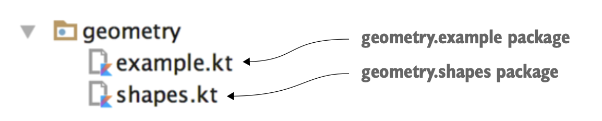
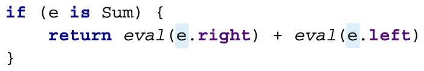

# Kotlin basics

## 2.1 기본 요소

### 2.1.1 Hello, World!

```kotlin
fun main(args: Array<String>) {
    println("Hello, world!")
}
```

* 함수를 선언할 땐 `fun` 키워드를 사용한다.
* 파라미터 이름 뒤에 파라미터 타입을 작성한다.
* 함수를 최상위 수준에 정의할 수 있다. (자바와 달리) 꼭 클래스 안에 함수를 넣어야 할 필요가 없다.
* 배열도 일반적인 클래스와 마찬가지다. 코틀린에는 자바와 달리 배열 처리를 위한 문법이 따로 존재하지 않는다.
* `System.out.println` 대신 `println`이라 쓴다. 코틀린 표준 라이브러리는 여러 가지 표준 자바 라이브러리 함수를 간결하게 사용할 수 있게 감싼 래퍼를 제공한다.
* `;`을 붙이지 않아도 된다.

### 2.1.2 함수

```kotlin
fun max(a: Int, b: Int): Int {
    return if (a > b) a else b
}
```

함수 선언은 `fun` 키워드로 시작한다. `fun` 다음 함수 이름이 온다. 함수 이름 뒤에는 괄호 안헤 파라미터 목록이 온다. 함수의 반환 타입은 파라미터 목록의 닫는 괄호 다음에 오는데, 괄호와 타입 사이 `:`으로 구분해야 한다.

다음은 코틀린 함수의 기본 구조이다. 코틀린의 `if`는 문장이 아니고 결과를 만드는 식(expression)이다. 이는 자바의 3항 연산자와 유사하다.

<div align="center">

</div>

#### 식이 본문인 함수

위 코드를 조금 더 간결하게 표현할 수 있다. 중괄호를 없애고 `return`을 제거하여 `=`를 식 앞에 붙이면 더 간결하게 표현할 수 있다.

```kotlin
fun max(a: Int, b: Int): Int = if (a > b) a else b
```

본문이 중괄호로 둘러싸인 함수를 **블록이 본문인 함수**라 하고, 등호와 식으로 이루어진 함수를 **식이 본문인 함수**라 한다.

반환 타입을 생략하면 `max` 함수를 더 간략하게 만들 수 있다. 이는 코틀린에서 타입 추론을 지원하기에 가능하다.

```kotlin
fun max(a: Int, b: Int) = if (a > b) a else b
```

### 2.1.3 변수

코틀린에서는 타입 지정을 생략하는 경우가 흔하다. 타입으로 변수 선언을 시작하면 타입을 생략할 경우 식과 변수 선언을 구별할 수 없다. 그런 이유로 키워드로 변수 선언을 시작하는 대신 변수 이름 뒤에
타입을 명시하거나 생략하게 허용한다. 

```kotlin
val question =
    "The Ultimate Question of Life, the Universe, and Everything"
val answer = 42
```

다음과 같이 타입을 명시해도 된다.

```kotlin
val answer: Int = 42
```

초기화 식을 사용하지 않고 변수를 선언하려면 변수 타입을 반드시 명시해야 한다.

```kotlin
val answer: Int
answer = 42
```

초기화 식이 없다면 변수에 저장될 값에 대해 아무 정보가 없기 때문에 컴파일러가 타입을 추론할 수 없다. 그러므로 타입을 반드시 지정해야 한다.

#### 변경 가능한 변수와 변경 불가능한 변수

* `val`: 변경 불가능한 참조를 저장하는 변수다. 자바로 말하자면 `final` 변수에 해당한다.
* `var`: 변경 가능한 참조다. 자바의 일반 변수에 해당한다.

기본적으로 모든 변수를 `val` 키워드를 사용해 불변 변수로 선언하고, 나중에 필요할 때 `var`로 변경하라. 변경 불가능한 참조와 변경 불가능한 객체를 사이드 이펙트가 없는 함수와
조합해 사용하면 코드가 함수형 코드에 가까워진다.

`val` 변수는 블록을 실행할 때 한 번만 초기화되어야 한다. 하지만 어떤 블록이 실행될 때 오직 한 초기화 문장만 실행됨을 컴파일러가 확인할 수 있다면 조건에 따라 `val`은 여러 값으로 초기화할 수 있다.

```kotlin
val message: String
if (canPerformOperation()) {
    message = "Success"
    // ... perform the operation
} else {
    message = "Failed"
}
```

`val` 참조 자체는 불변일지라도 그 참조가 가리키는 객체 내부의 값은 변경될 수 있다.

```kotlin
val languages = arrayListOf("Java") // Declares an immutable reference
languages.add("Kotlin")             // Mutates the object pointed to by the reference
```

`var` 키워드를 사용하면 변수 값을 변경할 수 있지만 변수 타입은 고정되어 바뀌지 않는다.

```kotlin
var answer = 42
answer = "no answer"    // Error: type mismatch
```

### 2.1.4 더 쉽게 문자열 형식 지정: 문자열 템플릿

```kotlin
fun main(args: Array<String>) {
    val name = if (args.size > 0) args[0] else "Kotlin"
    println("Hello, $name!")
}
```

위 예제는 문자열 템플릿(string template)이라는 기능을 보여준다. `name` 변수를 선언하고 다음 줄에 있는 문자열 리터럴(string literal)에서 그 변수를 사용했다. 여러 스크립트 언어와 비슷하게
코틀린도 변수를 문자열 안에 사용할 수 있다. 문자열 리터럴의 필요한 곳에 변수를 넣되 변수 앞에 `$`를 추가해야 한다.

`$` 문자를 넣고 싶으면  `\`를 사용해 이스케이프 시킨다. 

복잡한 식도 중괄호(`{}`)로 둘러싸서 문자열 템플릿 안에 넣을 수 있다.

```kotlin
fun main(args: Array<String>) {
    println("Hello, ${if (args.size > 0) args[0] else "someone"}!")
}
```

## 2.2 클래스와 프로퍼티

다음은 자바빈(JavaBean) 클래스인 `Person`이다.

```java
/* Java */
public class Person {
    private final String name;

    public Person(String name) {
        this.name = name;
    }

    public String getName() {
        return name;
    }
}
```

필드가 둘 이상으로 늘어나면 생성자에서 필드에 대입하는 대입문의 수도 늘어난다. 하지만 코틀린은 그런 필드 대입 로직을 훨씬 더 적은 코드로 작성할 수 있다. 코틀린으로 변환해보자.

```kotlin
class Person(val name: String)
```

이러한 유형의 클래스(코드 없이 데이터만 저장하는 클래스)를 값 객체(value object)라 부르며, 값 객체를 간결하게 기술할 수 있는 구문을 제공한다.

코틀린 변환 결과 `public` visibility modifier가 없어졌다. 코틀린의 기본 가시성은 `public`이므로 이런 경우 modifier를 생략해도 된다.

### 2.2.1 프로퍼티

클래스라는 개념은 데이터를 캡슐화하고 캡슐화한 데이터를 다루는 코드를 한 주체 아래 가두는 것이다. 자바에서는 데이터를 필드에 저장하며, 멤버 필드의 가시성은 보통 `private`이다. 이 데이터에
접근할 수 있도록 접근자 메서드(accessor method)를 제공한다. 자바에서는 필드와 접근자를 하나로 묶어 프로퍼티라 한다.

코틀린은 프로퍼티를 기본 기능으로 제공하며, 자바의 필드와 접근자 메서드를 완전히 대신한다. 프로퍼티를 선언할 때는 앞서 살펴본 변수를 선언하는 방법과 마찬가지로 `val`이나 `var`를 사용한다. 

```kotlin
class Person(
    val name: String,       // Read-only property: generates a field and a trivial getter
    var isMarried: Boolean  // Writable property: a field, a getter, and a setter
)
```

기본적으로 코틀린에서 프로퍼티를 선언하는 방식은 프로퍼티와 관련 있는 접근자를 선언하는 것이다.

`getter`, `setter` 이름을 정하는 규칙에 예외가 있다. 이름이 `is`로 시작하는 프로퍼티의 `getter`에는 `get`이 붙지 않고 원래 이름 그대로 사용하며, `setter`에는 `is`를 `set`으로 바꾼 이름을 사용한다.

코틀린에서는 `getter`를 호출하는 대신 프로퍼티를 직접 사용했다. 자바의 `getter`, `setter`와 로직은 동일하지만 코드는 더 간결해졌다. 

```kotlin
val person = Person("Bob", true)
println(person.name)        // Bob
println(person.isMarried)   // true
```

대부분의 프로퍼티에는 그 프로퍼티의 값을 저장하기 위한 필드가 있다. 이를 뒷받침하는 필드(backing field)라 부른다. 원한다면 프로퍼티 값을 그때그때 게산할 수도 있다. 

### 2.2.2 커스텀 접근자

프로퍼티의 접근자를 직접 작성해보자. 직사각형 클래스에서 자신이 정사각형인지 알려주는 기능을 만들어보자.

```kotlin
class Rectangle(val height: Int, val width: Int) {
    val isSquare: Boolean
        get() {         // Property getter declaration
            return height == width
        }
}
```

`isSquare` 프로퍼티는 자체 값을 저장하는 필드가 필요 없다. 클라이언트가 프로퍼티에 접근할 때마다 `getter`가 프로퍼티 값을 매번 다시 계산한다.

이런 경우 블록을 사용하지 않아도 `get() = height == width`라 해도 된다. 

### 2.2.3 코틀린 소스코드 구조: 디렉터리와 패키지

자바의 경우 모든 클래스를 패키지 단위로 관리한다. 코틀린도 자바와 유사한 개념의 패키지가 있다. 모든 코틀린 파일의 맨 앞에 `package` 문을 넣을 수 있다. 그러면 그 파일 안에 있는
모든 선언이 해당 패키지에 들어간다. 다른 패키지에 정의한 선언을 사용하려면 `import`를 통해 선언을 불러와야 한다. `import` 문은 파일의 맨 앞에 와야 한다. 

```kotlin
package geometry.shapes     // Package declaration

import java.util.Random     // Imports the standard Java library class

class Rectangle(val height: Int, val width: Int) {
    val isSquare: Boolean
        get() = height == width
}

fun createRandomRectangle(): Rectangle {
    val random = Random()
    return Rectangle(random.nextInt(), random.nextInt())
}
```

코틀린은 클래스 `import`와 함수 `import`에 차이가 없으며, 모든 선언을 `import` 키워드로 가져올 수 있다.

```kotlin
package geometry.example

import geometry.shapes.createRandomRectangle    // Imports a function by name

fun main(args: Array<String>) {
    println(createRandomRectangle().isSquare)   // Prints “true” incredibly rarely
}
```

패키지 이름 뒤에 `.*`를 추가하면 패키지 안 모든 선언을 import 할 수 있다.

자바는 패키지의 구조와 일치하는 디렉터리 계층 구조를 만들고 클래스의 소스코드를 그 클래스가 속한 패키지와 같은 디렉터리에 위치시켜야 한다.

<div align="center">

</div>

코틀린에서는 여러 클래스를 한 파일에 넣을 수 있고, 파일 이름도 마음대로 정할 수 있다. 따라서 원하는 대로 소스코드를 구성할 수 있다.

<div align="center">

</div>

하지만 대부분 자바와 같이 패키지별로 디렉터리를 구성하는 것이 좋다. 여러 클래스를 한 파일에 넣는 것을 주저해서는 안 된다. 특히 각 클래스를 정의하는 소스코드 크기가 아주 작은 경우 더욱 그렇다.

## 2.3 선택 표현과 처리: enum과 when

### 2.3.1 enum 클래스 정의

```kotlin
enum class Color {
    RED, ORANGE, YELLOW, GREEN, BLUE, INDIGO, VIOLET
}
```

`enum`은 자바 선언보다 코틀린 선언에 더 많은 키워드를 써야 하는 흔치 않은 예다. 코틀린에서는 `enum class`를 사용하지만 자바는 `enum`을 사용한다. 코틀린에서 `enum`은 소프트 키워드(soft keyword)라
부른다. `enum`은 `class` 앞에 있을 때 특별한 의미를 지니지만 다른 곳에서 이름에 사용할 수 있다. 반면 `class`는 키워드다. 따라서 `class` 이름을 사용할 수 없으므로 클래스를 표현하는 변수
등을 정의할 때는 `clazz`나 `aClass`와 같은 이름을 사용해야 한다.

코틀린의 `enum`은 클래스 안에 프로퍼티나 메서드를 정의할 수 있다.

```kotlin
enum class Color(
    val r: Int, val g: Int, val b: Int      // Declares properties of enum constants
) {
    RED(255, 0, 0), ORANGE(255, 165, 0),    // Specifies property values when each constant is created
    YELLOW(255, 255, 0), GREEN(0, 255, 0), BLUE(0, 0, 255),
    INDIGO(75, 0, 130), VIOLET(238, 130, 238);  // The semicolon here is required

    fun rgb() = (r * 256 + g) * 256 + b     // Defines a method on the enum class
}
```

`enum`에서도 일반적인 클래스와 마찬가지로 생성자와 프로퍼티를 선언한다. 각 `enum` 상수를 정의할 때는 그 상수에 해당하는 프로퍼티 값을 지정해야만 한다.

### 2.3.2 when으로 enum 클래스 다루기

자바는 `switch`가 있다면 코틀린은 `when`이 있다. `if`와 마찬가지로 `when`도 값을 만들어내는 식이다. 

```kotlin
fun getMnemonic(color: Color) = // Returns a “when” expression directly
    when (color) {              // Returns the corresponding string if the color equals the enum constant 
        Color.RED -> "Richard"
        Color.ORANGE -> "Of"
        Color.YELLOW -> "York"
        Color.GREEN -> "Gave"
        Color.BLUE -> "Battle"
        Color.INDIGO -> "In"
        Color.VIOLET -> "Vain"
    }
```

자바와 달리 각 분기 끝에 `break`를 넣지 않아도 된다. 한 분기 안에서 `,`를 사용해 여러 값을 매치 패턴으로 사용할 수 있다.

```kotlin
fun getWarmth(color: Color) = when(color) {
    Color.RED, Color.ORANGE, Color.YELLOW -> "warm"
    Color.GREEN -> "neutral"
    Color.BLUE, Color.INDIGO, Color.VIOLET -> "cold"
}
```

상수 값을 import하면 이 코드를 더 간단하게 만들 수 있다.

```kotlin
import ch02.colors.Color        // Imports the Color class declared in another package
import ch02.colors.Color.*      // Explicitly imports enum constants to use them by names

fun getWarmth(color: Color) = when (color) {
    RED, ORANGE, YELLOW -> "warm"       // Uses imported constants by name
    GREEN -> "neutral"
    BLUE, INDIGO, VIOLET -> "cold"
}
```

### 2.3.3 when과 임의의 객체를 함께 사용

코틀린의 `when`은 자바의 `switch`보다 훨씬 더 강력하다. 분기 조건에 상수만을 사용할 수 있는 자바와 달리 코틀린은 임의 객체를 허용한다.

```kotlin
fun mix(c1: Color, c2: Color) =
    when (setOf(c1, c2)) {              // An argument of the “when” expression can be any object. It’s checked for equality with the branch conditions.
        setOf(RED, YELLOW) -> ORANGE    // Enumerates pairs of colors that can be mixed
        setOf(YELLOW, BLUE) -> GREEN
        setOf(BLUE, VIOLET) -> INDIGO
        else -> throw Exception("Dirty color")      // Executed if none of the other branches were matched
    }
```

`c1`, `c2`가 `RED`와 `YELLOW`라면 그 둘은 혼합한 결과는 `ORANGE`다. 이를 비교하기 위해 집합 비교를 사용한다. `setOf(c1, c2)`와 분기 조건에 있는 객체를 매치할 때 동등성(equility)을 사용한다.

`when` 분기 조건 부분에 식을 넣을 수 있기 때문에 코드를 더 간결하게 작성할 수 있다.

### 2.3.4 인자 없는 when 사용

위 코드는 호출될 때마다 함수 인자로 주어진 두 색이 `when` 분기 조건에 있는 다른 두 색과 같은지 비교하기 위해 여러 `Set` 인스턴스를 생성하므로 비효율적이다. 

인자가 없은 `when` 식을 사용하면 불필요한 객체 생성을 막을 수 있다. 코드가 약간 읽기 어려워지지만 성능은 향상시킬 수 있다.

```kotlin
fun mixOptimized(c1: Color, c2: Color) =
    when {
        (c1 == RED && c2 == YELLOW) || 
        (c1 == YELLOW && c2 == RED) -> 
            ORANGE
        (c1 == YELLOW && c2 == BLUE) ||
        (c1 == BLUE && c2 == YELLOW) ->
            GREEN
        (c1 == BLUE && c2 == VIOLET) ||
        (c1 == VIOLET && c2 == BLUE) ->
            INDIGO
        else -> throw Exception("Dirty color")
    }
```

`when`에 아무 인자도 없으려면 각 분기 조건이 `boolean` 결과를 계산하는 식이여야 한다. 

### 2.3.5 스마트 캐스트: 타입 검사와 타입 캐스트를 조합

간단한 예제를 통해 알아보자. 

```kotlin
interface Expr          
class Num(val value: Int) : Expr        // Simple value object class with one property, value, implementing the Expr interface
class Sum(val left: Expr, val right: Expr) : Expr   // The argument of a Sum operation can be any Expr: either Num or another Sum
```

`Sum`은 `Expr` 왼쪽과 오른쪽 인자에 대한 참조를 `left`와 `right` 프로퍼티로 저장한다. `left`와 `right`는 각각 `Num`이나 `Sum`일 수 있다. `(1 + 2) + 4`라는 식을
저장하면 `Sum(Sum(Num(1), Num(2)), Num(4))`라는 구조의 객체가 생긴다. 

<div align="center">

</div>

`Expr`은 두 가지 구현 클래스가 존재한다.

* 어떤 식이 수라면 그 값을 반환한다.
* 어떤 식이 합계라면 좌항과 우항의 값을 계산한 다음 그 두 값을 합한 값을 반환한다.

```kotlin
fun eval(e: Expr): Int {
    if (e is Num) {         // 자바 스타일
        val n = e as Num    // This explicit cast to Num is redundant.
        return n.value
    }
    if (e is Sum) {         // 코틀린 스타일
        return eval(e.right) + eval(e.left) // The variable e is smart-cast
    }
    throw IllegalArgumentException("Unknown expression")
}
```

코틀린은 컴파일러가 대신 캐스팅을 해준다. 어떤 변수가 원하는 타입인지 일단 `is`로 검사하고 나면 굳이 변수를 원하는 타입으로 캐스팅하지 않아도 그 변수가 원하는 타입으로 선언된 것처럼
사용할 수 있다. 이를 **스마트 캐스트**라 부른다.

IDE는 배경색으로 스마트 캐스트 부분을 표시해준다. 

<div align="center">

</div>

스마트 캐스트는 `is`로 변수에 든 값의 타입을 검사한 다음 그 값이 바뀔 수 없는 경우에만 작동한다. 프로퍼티는 반드시 `val`이여야 하며 커스텀 접근자를 사용한 것이여도 안 된다. `val`이 아니거나
`val`이지만 커스텀 접근자를 사용하는 경우 해당 프로퍼티에 대한 접근이 항상 같은 값을 내놓는다고 확신할 수 없기 때문이다.

원하는 타입으로 명시적으로 캐스팅하려면 `as` 키워드를 사용한다.

```kotlin
val n = e as Num
```

### 2.3.6 리팩토링: if를 when으로 변경

`return` 문과 중괄호를 없애고 `if` 식을 본문으로 사용해 더 간단하게 만들 수 있다.

```kotlin
fun eval(e: Expr): Int =
    if (e is Num) {
        e.value
    } else if (e is Sum) {
        eval(e.right) + eval(e.left)
    } else {
        throw IllegalArgumentException("Unknown expression")
    }
```

`if` 분기에 식이 하나라면 중괄호를 생략해도 된다. `if` 분기에 블록을 사용하는 경우 블록의 마지막 식이 결과 값이다. 

```kotlin
fun eval(e: Expr): Int =
    when (e) {
        is Num ->   // “when” branches that check the argument type
            e.value // Smart casts are applied here    
        is Sum ->   // “when” branches that check the argument type
            eval(e.right) + eval(e.left)    // Smart casts are applied here
        else ->
            throw IllegalArgumentException("Unknown expression")
    }
```

### 2.3.7 if와 when의 분기에서 블록 사용

`if`나 `when` 모두 분기에 블록을 사용할 수 있다. 이 경우 블록의 마지막 문장이 블록 전체의 결과가 된다. 

```kotlin
fun evalWithLogging(e: Expr): Int =
    when (e) {
        is Num -> {
            println("num: ${e.value}")
            e.value     // This is the last expression in the block and is returned if e is of type Num.
        }
        is Sum -> {
            val left = evalWithLogging(e.left)
            val right = evalWithLogging(e.right)
            println("sum: $left + $right")
            left + right        // This expression is returned if e is of type Sum.
        }
        else -> throw IllegalArgumentException("Unknown expression")
    }
```

## 2.4 대상을 이터레이션: while과 for 루프

코틀린의 `for`는 `for <아이템> in <원소들>` 형태를 취한다. 

### 2.4.1 while 루프

코틀린에는 `while`과 `do-while` 루프가 있다. 자바와 크게 다르지 않다.

```kotlin
while (condition) {     // The body is executed while the condition is true.
    /*...*/
}

do {
    /*...*/
} while (condition)     // The body is executed for the first time unconditionally. After that, it’s executed while the condition is true.
```

### 2.4.2 수에 대한 이터레이션: 범위와 수열

코틀린에서는 범위(range)를 사용한다. 범위는 기본적으로 두 값으로 이뤄진 구간이다. `..` 연산자로 시작 값과 끝 값을 연결해 범위를 만든다.

```kotlin
val oneToTen = 1..10
```

코틀린의 범위는 폐구간(닫힌 구간) 또는 양끝을 포함하는 구간이다. 이는 위 코드에서 10이 포함된다는 의미이다. 

범위에 속한 값을 일정한 순서로 이터레이션하는 경우를 수열(progression)이라 부른다. Fizz-Buzz 게임을 예로 보자.

```kotlin
fun fizzBuzz(i: Int) = when {
    i % 15 == 0 -> "FizzBuzz "  // If i is divisible by 15, returns FizzBuzz. As in Java, % is the modulus operator.
    i % 3 == 0 -> "Fizz "       // If i is divisible by 3, returns Fizz
    i % 5 == 0 -> "Buzz "       // If i is divisible by 5, returns Buzz
    else -> "$i "               // Else returns the number itself
}

for (i in 1..100) {             // Iterates over the integer range 1..100
    print(fizzBuzz(i))
}
```

100부터 거꾸로 세되 짝수만으로 게임을 진행해보자.

```kotlin
for (i in 100 downTo 1 step 2) {
    print(fizzBuzz(i))
}
```

여기서는 증가 값 `step`을 갖는 수열에 대해 이터레이션한다. 증가 값을 음수로 만들면 역방향 수열을 만들 수 있다. `100 downTo 1`은 역방향 수열을 만든다. 

앞서 소개된 대로 `..`는 범위의 끝 값을 포함한다. 하지만 끝 값을 포함하지 않는 반만 닫힌 범위(half-closed range)에 대해 이터레이션을 하고 싶다면 `until` 함수를 사용한다. 

### 2.4.3 맵에 대한 이터레이션

문자에 대한 2진 표현을 출력하는 프로그램 예제를 보자.

```kotlin
val binaryReps = TreeMap<Char, String>()    // Uses TreeMap so the keys are sorted
for (c in 'A'..'F') {       // Iterates over the characters from A to F using a range of characters
    val binary = Integer.toBinaryString(c.toInt())  // Converts ASCII code to binary
    binaryReps[c] = binary      // Stores the value in a map by the c key
}

for ((letter, binary) in binaryReps) {  // Iterates over a map, assigning the map key and value to two variables
    println("$letter = $binary")
}
```

`..`는 문자 타입의 값에도 적용할 수 있다. 두 번째 `for` 문에서 객체를 풀어 각 부분을 분리하는 구조 분해 문법을 사용할 수 있다.

```kotlin
binaryReps[c] = binary
```

코드는

```kotlin
binaryReps.put(c, binary)
```

라는 자바 코드와 같다. 출력은 다음과 같다.

```
A = 1000001
B = 1000010
C = 1000011
D = 1000100
E = 1000101
F = 1000110
```

구조 분해 구문을 맵이 아닌 컬렉션에도 활용할 수 있다.

```kotlin
val list = arrayListOf("10", "11", "1001")
for ((index, element) in list.withIndex()) {    // Iterates over a collection with an index
    println("$index: $element")
}
```

출력은 다음과 같다.

```
0: 10
1: 11
2: 1001
```

컬렉션이나 범위에 대해 `in` 키워드를 살펴봤다. 

### 2.4.4 in으로 컬렉션이나 범위의 원소 검사

`in` 연산자를 사용해 어떤 값이 범위에 속하는지 검사할 수 있다. 반대로 `!in`을 사용해 어떤 값이 범위에 속하지 않는지 검사할 수 있다.

```kotlin
fun isLetter(c: Char) = c in 'a'..'z' || c in 'A'..'Z'
fun isNotDigit(c: Char) = c !in '0'..'9'

println(isLetter('q'))      // true
println(isNotDigit('x'))    // true
```

이러한 비교 로직은 표준 라이브러리의 범위 클래스 구현 안에 감춰져 있다.

```kotlin
c in 'a'..'z'       // Transforms to a <= c && c <= z
```

`when` 식에서 사용해도 된다.

```kotlin
fun recognize(c: Char) = when (c) {
    in '0'..'9' -> "It's a digit!"      // Checks whether the value is in the range from 0 to 9
    in 'a'..'z', in 'A'..'Z' -> "It's a letter!"    // You can combine multiple ranges.
    else -> "I don't know..."
}
println(recognize('8'))     // It's a digit!
```

범위는 문자에만 국한되지 않는다. 비교가 가능한 클래스라면 그 클래스의 인스턴스 객체를 사용해 범위를 만들 수 있다. `Comparable`을 사용하는 범위의 경우 그 범위 내 모든 객체를 항상
이터레이션하지는 못한다. 예를 들어, "Java"와 "Kotlin" 사이 모든 문자열을 이터레이션 할 수 없다. 하지만 `in` 연산자를 사용해 값이 범위 안에 속하는지 결정할 수 있다.

```kotlin
println("Kotlin" in "Java".."Scala") // The same as “Java” <= “Kotlin” && “Kotlin” <= “Scala”
// true
```

컬렉션도 마찬가지로 `in` 연산을 사용할 수 있다.

```kotlin
println("Kotlin" in setOf("Java", "Scala"))
// false
```

## 2.5 코틀린의 예외 처리

코틀린의 예외 처리는 자바나 다른 언어의 예외 처리와 비슷하다. 

```kotlin
if (percentage !in 0..100) {
    throw IllegalArgumentException(
        "A percentage value must be between 0 and 100: $percentage")
}
```

자바와 달리 코틀린의 `throw`는 식이므로 다른 식에 포함될 수 있다.

```kotlin
val percentage =
    if (number in 0..100)
        number
    else
        throw IllegalArgumentException(     // “throw” is an expression.
            "A percentage value must be between 0 and 100: $number")
```

### 2.5.1 try, catch, finally

```kotlin
fun readNumber(reader: BufferedReader): Int? {  // You don’t have to explicitly specify exceptions that can be thrown from this function.
    try {
        val line = reader.readLine()
        return Integer.parseInt(line)
    } catch (e: NumberFormatException) {        // The exception type is on the right.
        return null
    } finally {                                 // “finally” works just as it does in Java.
        reader.close()
    }
}
```

자바 코드와의 차이는 `throws` 절이 없다는 것이다. 자바는 함수를 작성할 때 함수 선언 뒤 `throws IOException`을 붙여야 한다. `IOException`이 checked exception
이기 때문이다. 어떤 함수가 던질 가능성이 있는 예외나 그 함수가 호출한 다른 함수에서 발생할 수 있는 예외 모두 `catch`로 처리해야 하며, 처리하지 않은 예외는 `throws` 절에 명시해야 한다.

코틀린은 checked exception과 unchecked exception을 구분하지 않는다. 코틀린에서는 함수가 던지는 예외를 지정하지 않고 발생한 예외를 잡아내도 되고 잡아내지 않아도 된다.

### 2.5.2 try를 식으로 사용

```kotlin
fun readNumber(reader: BufferedReader) {
    val number = try {
        Integer.parseInt(reader.readLine()) // Becomes the value of the “try” expression
    } catch (e: NumberFormatException) {
        return
    }
    println(number)
}

val reader = BufferedReader(StringReader("not a number"))
readNumber(reader)  // Nothing is printed.
```

`try` 키워드는 `if`나 `when`과 마찬가지로 식이다. `try` 값을 변수에 대입할 수 있다. `if`와 달리 `try`의 본문을 반드시 중괄호로 둘러싸야 한다.

```kotlin
fun readNumber(reader: BufferedReader) {
    val number = try {
        Integer.parseInt(reader.readLine()) // This value is used when no exception happens.
    } catch (e: NumberFormatException) {
        null                                // The null value is used in case of an exception.
    }
    println(number)
}
val reader = BufferedReader(StringReader("not a number"))
readNumber(reader)
// null  <= An exception is thrown, so the function prints “null”.
```